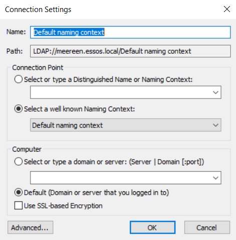
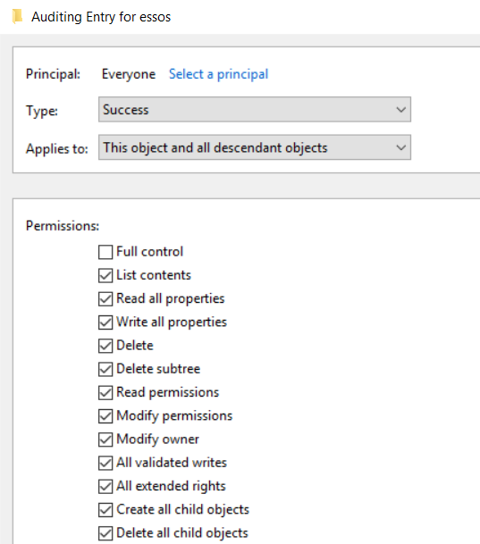
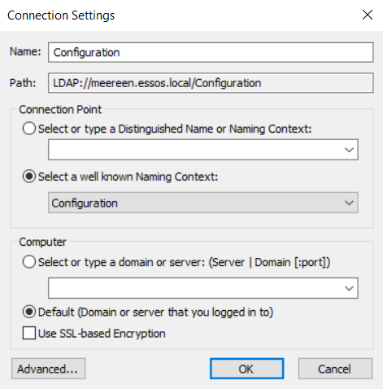
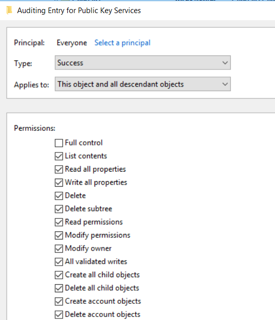
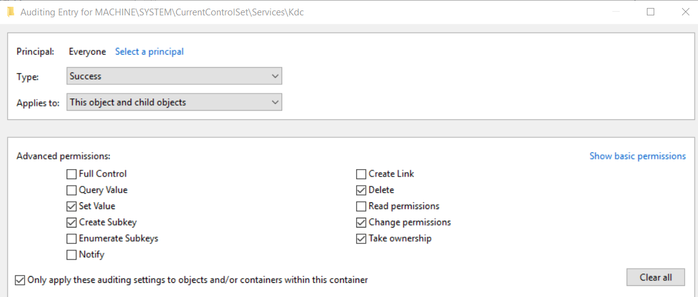

# Preparing GOAD

1. Install GOAD following the [instructions](https://orange-cyberdefense.github.io/GOAD/installation/), upgrading the SRV03 host version.

   To do this, modify the file `ad\GOAD\providers\vmware\Vagrantfile`

   ```
   boxes = [
     # windows server 2019
     { :name => "GOAD-DC01",  :ip => "{{ip_range}}.10", :box => "StefanScherer/windows_2019", :box_version => "2021.05.15", :os => "windows", :cpus => 2, :mem => 3000},
     # windows server 2019
     { :name => "GOAD-DC02",  :ip => "{{ip_range}}.11", :box => "StefanScherer/windows_2019", :box_version => "2021.05.15", :os => "windows", :cpus => 2, :mem => 3000},
     # windows server 2016
     { :name => "GOAD-DC03",  :ip => "{{ip_range}}.12", :box => "StefanScherer/windows_2016", :box_version => "2017.12.14", :os => "windows", :cpus => 2, :mem => 3000},
     # windows server 2019
     { :name => "GOAD-SRV02", :ip => "{{ip_range}}.22", :box => "StefanScherer/windows_2019", :box_version => "2021.05.15", :os => "windows", :cpus => 2, :mem => 6000},
     # windows server 2016
     # { :name => "GOAD-SRV03", :ip => "{{ip_range}}.23", :box => "StefanScherer/windows_2016", :box_version => "2019.02.14", :os => "windows", :cpus => 2, :mem => 5000}
     { :name => "GOAD-SRV03", :ip => "{{ip_range}}.23", :box => "StefanScherer/windows_2022", :box_version => "2021.08.23", :os => "windows", :cpus => 2, :mem => 5000}
   ]
   ```
2. Additionally, run the playbook for installing ELK+Winlogbeat:

   ```
   provision elk
   ```

If the playbook doesn’t work, you can install it manually:

* Install [Docker compose](https://docs.docker.com/compose/install/)
* Run Elasticsearch+Kibana from the `docker-compose.yml` file
* [Install](https://www.elastic.co/docs/reference/beats/winlogbeat/winlogbeat-installation-configuration#installation) (Step 1) Winlogbeat on DC03 and SRV03
* [Configure](https://www.elastic.co/docs/reference/beats/winlogbeat/winlogbeat-installation-configuration#set-connection) (Step 2-6) Winlogbeat to send events to the installed Elasticsearch.
  The sending config will look something like this `C:\Program Files\Winlogbeat\winlogbeat.yml`:

  ```yml
  output.elasticsearch:
    hosts: ["192.168.56.100:9200"]
    username: "elastic"
    password: "elastic"
    pipeline: "winlogbeat-%{[agent.version]}-routing"
  ```

3. Configure audit policies on DC03 and SRV03 (ADCS).

   ```
   Category/Subcategory                      Setting
   System
     Security System Extension               Success
     Security State Change                   Success
   Logon/Logoff
     Logon                                   Success and Failure
     Account Lockout                         Failure
     Special Logon                           Success and Failure
   Object Access
     Registry                                Success and Failure
     Certification Services                  Success and Failure
     File Share                              Success
     Other Object Access Events              Success
   Privilege Use
     Sensitive Privilege Use                 Success
   Policy Change
     Audit Policy Change                     Success
     MPSSVC Rule-Level Policy Change         Success
   Account Management
     Computer Account Management             Success and Failure
     Application Group Management            Success
     User Account Management                 Success and Failure
   DS Access
     Directory Service Access                Success and Failure
     Directory Service Changes               Success and Failure
   Account Logon
     Kerberos Service Ticket Operations      Success and Failure
     Kerberos Authentication Service         Success and Failure
     Credential Validation                   Success and Failure
   ```

4. Configure Active Directory object auditing.

* On DC03 as user daenerys.targaryen → Win+R → adsiedit.msc
* Right-click on "ADSI Edit" and select "Connect to"
* Connect to Default Naming Context:

  
* Right-click the domain "DC=essos,DC=local", select Properties → Security → Advanced → Auditing → Add → Select Principal → Everyone

  Since we are working in a test environment, we can afford to choose advanced audit settings:

  

5. Configure Active Directory Certificate Services object auditing.

* On DC03 as user daenerys.targaryen → Win+R → adsiedit.msc

* Right-click on "ADSI Edit" and select "Connect to"

* Connect to Configuration:

  

* Open the directory CN=Configuration,DC=essos,DC=local → CN=Services → CN=Public Key Services

* Right-click on "CN=Public Key Services", select Properties → Security → Advanced → Auditing → Add → Select Principal → Everyone

  Since we are working in a test environment, we can afford to choose advanced audit settings:

  

6. Configure Active Directory Certificate Services auditing

* On SRV03 as user daenerys.targaryen → Win+R → cmd
* Run the commands:

  ```
  certutil -setreg CA\AuditFilter 127
  certutil -setreg policy\EditFlags +EDITF_AUDITCERTTEMPLATELOAD
  net stop certsvc && net start certsvc
  ```

7. Configure registry key auditing.

* On DC03 as user daenerys.targaryen → Win+R → gpedit.msc
* Right-click on Default Domain Policy → Edit
* Computer Configuration → Policies → Windows Settings → Security Settings → Registry → Add key

  For each registry key from the list, choose auditing as in the screenshot

  ```
  MACHINE\SYSTEM\CurrentControlSet\Services\CertSvc\Configuration
  MACHINE\SYSTEM\CurrentControlSet\Control\SecurityProviders\SCHANNEL
  MACHINE\SYSTEM\CurrentControlSet\Services\Kdc

  Additionally add Query value, Enumerate Subkeys: 
  MACHINE\SOFTWARE\Yubico\YubiHSM\
  ```

  

8. Take snapshots of SRV03 and DC03 before installing updates
9. Enable updates on SRV03 and DC03. The easiest way is to use [enable updates.bat](https://github.com/tsgrgo/windows-update-disabler)
10. Update SRV03 and DC03
11. Install [KALI](https://www.kali.org/get-kali/#kali-virtual-machines) and the latest version of [certipy](https://github.com/ly4k/Certipy/wiki/04-‐-Installation) (preferably from source)
12. If you want to use a modified script to retrieve information about issued certificates from the ADCS database, use the script [Get-CertRequest.ps1](https://github.com/DimaShchetinin/PSPKIAudit/blob/main/Code/Get-CertRequest.ps1) from the [PSPKIAudit fork](https://github.com/DimaShchetinin/PSPKIAudit). Installation instructions can be found there as well.